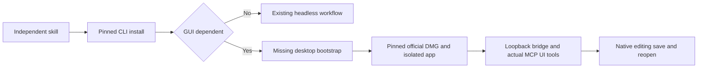

# Craft desktop first-use closure

All four current skill runtime locks install CLI artifacts only. Bridge mode requires an already running desktop app. This leaves a gap in independent single-skill GUI first use; existing headless creative acceptance remains separately scoped.

Four official v0.2.0 DMGs pass GitHub asset digest versus downloaded bytes, isolated app copy, bundle version, arm64 Mach-O and strict code signature verification. Existing user apps were not overwritten and security attributes were not removed. Film starts with isolated data, --control, --empty and --no-recover. Maintained CLI0.2.0-craft.2 discovers all666 pinned IDs; actual MCP ui_inspect/ui_elements pass. The owned test process exits afterward. CLI exec ui.inspect is the wrong interface, not evidence of GUI incompatibility.

The other three live bridges and all four independent skill desktop bootstraps remain unverified/unimplemented. Bootstrap must pin URL/archive identity, validate app/version/binary identity, isolate data and use explicit loopback control. Preserve system security controls and session identity. UI tools are distinct from domain command_run.

Keep the existing per-plugin OpenSpec CM-001 authority. Tasks8.16 and8.17 track implementation and fixed installed first use. Full per-command task8.3 stays open. This investigation does not establish GUI editing/save/reopen, exhaustive commands or fullV1.
