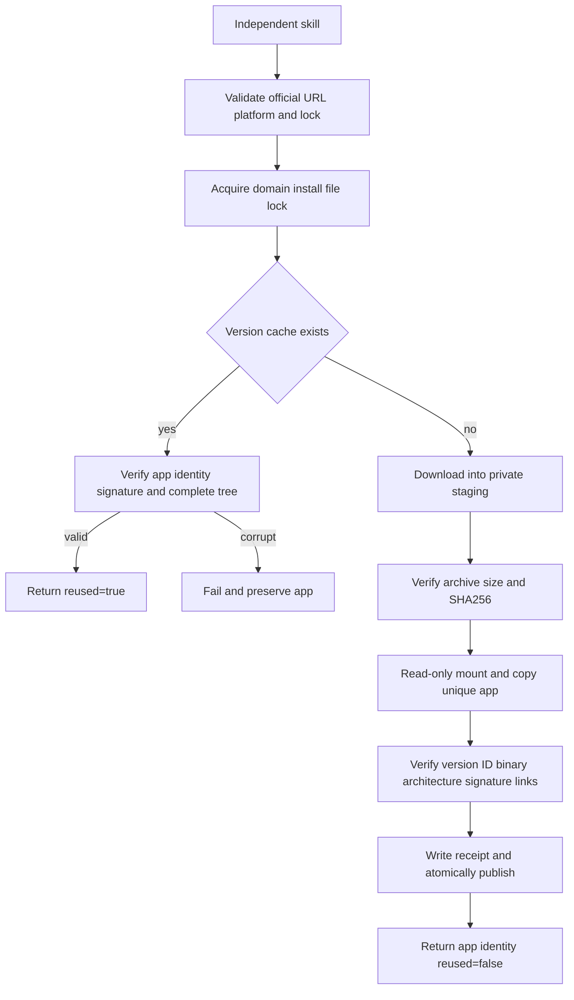

# Craft Desktop First-Use Architecture

> 2026-10-07. Scope: the standalone desktop installation component in four domain skill suites. This is source-candidate implementation; fixed-release skill installation and complete GUI acceptance remain open.

## 1. Entry and ownership

All 48 domain skills include their own `scripts/desktop.py`, `scripts/desktop.lock.json` and `references/desktop-install.md`. No sibling skill is required. Set `SKILL_DIR` to the actually loaded skill directory:

```bash
python3 -I -B "$SKILL_DIR/scripts/desktop.py" install
```

The JSON receipt returns actual app/executable paths, version, binary SHA256 and `reused`. Official desktop v0.2.0 is pinned for macOS arm64 separately from the maintained CLI. Matching version strings do not prove protocol compatibility. The default versioned user-data cache is `craft-runtimes/<domain>-desktop/<version>`; `--runtime-home` selects an isolated cache. ArtCraft retains child-domain skill receipts; this change adds neither ArtCraft desktop orchestration nor a Jianying adapter.

## 2. Install and recovery



Local `--archive` input must still match the complete pinned identity. Installed file hashes, symlink targets and receipt are rechecked; corrupt installs are never silently overwritten. Cross-process installation is serialized by a file lock. Failures clean only owned staging and detach only owned mounts; incomplete versions are not published. Installation does not modify PATH, overwrite user Applications, remove security attributes or launch applications.

## 3. Evidence and remaining gates

`tests/test_desktop_install.py` checks standalone resources, official URL constraints, unsupported-platform no-write behavior and bad-archive rejection. Native installation requires explicit `CRAFT_DESKTOP_FIRST_USE=1`; normal regressions do not download applications. Each native case copies exactly one skill into `.agents/skills`, uses an empty cache and downloads the public official DMG. It checks unchanged reuse, corrupt-receipt rejection, preserved application and unchanged skill resources.

The authoritative batch result is `docs/evidence/craft-desktop-source48-first-use-20261007.json`; do not claim batch acceptance if that report is missing or failed. Source-candidate evidence is distinct from installed fixed-release evidence.

Earlier investigation verified four official DMGs and Film live MCP `ui_inspect`, `ui_elements`, and 666 live command entries. Effect also passed isolated `EFFECTCRAFT_CONFIG_DIR`, signed desktop startup, pinned CLI bridge, 640 live entries and actual MCP `ui_inspect`; its owned app process was terminated. Photo and Vector live bridges were subsequently verified in section 4; automatic standalone startup remains open. UI MCP tools are not domain `command_run` operations; `exec ui.inspect` is not a substitute. Existing `commands.py --mode bridge` connects to an explicit active session and does not start or switch applications.

Existing domain OpenSpec 8.16/8.17 remain open for startup, fixed-release first use and GUI edit/save/reopen. The full command execution gate 8.3 remains open. Catalog coverage of 2639 entries is not execution acceptance of all 2639 commands.

## 4. Four live bridges and Vector gateway repair

[Runtime evidence](evidence/craft-four-desktop-live-bridge-20261007.json) covers all four signed desktop/pinned CLI connections. Photo used a private 0600 token file, removed after testing, with isolated configuration and authorized workspace. Vector disabled preferences/recovery via `VECTORCRAFT_NO_PREFS` and edited only an isolated project. All owned application processes exited. Film/Photo use `mcp --bridge 127.0.0.1:PORT`, Effect uses `mcp --bridge PORT`, and Vector uses `mcp --connect 127.0.0.1:PORT`. Film/Effect/Photo expose `ui_inspect`; Vector exposes `inspect_ui`. Live catalog counts are 666/640/748/763 rows respectively.

The Vector source-candidate bridge gateway maps only the verified `file.export` alias to engine `document.export`; receipts retain both requested `command` and actual `backendCommand`. Enabled checks use the actual operation in the same session. The pinned desktop registers both engine and UI variants of `file.place`; only this explicit pair is normalized to the engine context. Other missing or duplicate entries remain failures. Headless aliases and uniqueness checks remain unchanged. The 585 reflected Vector entries are covered through this explicit mapping, not by requiring identical GUI IDs.

The actual desktop case completed six steps: create, rectangle, SVG export, native save, reopen, inspect. Reopened geometry retained x/y=8/8 and width/height=24/24, dirty=false, and the SVG is well-formed XML. Vector regressions passed 80 tests and skipped 24 environment-dependent tests. This proves the selected case and candidate repair, not fixed-release installation or complete command execution. Standalone startup/process ownership passed the source verification in section 5; installed fixed-release verification remains open.

## 5. Standalone owned startup and shutdown

All 48 domain skills include their own `desktop_session.py`, `desktop.py run` and `examples/desktop-first-use.json`. Set SKILL_DIR to the actually loaded skill:

```bash
python3 -I -B "$SKILL_DIR/scripts/desktop.py" run "$SKILL_DIR/examples/desktop-first-use.json" --output "$OUTPUT"
```

OUTPUT must be new and its parent must exist. `--runtime-home` selects an isolated cache; `--input NAME=PATH` imports explicit assets. Plan/catalog/reference/input/platform checks precede installation. The workflow installs both pinned runtimes, starts an isolated desktop, and uses lsof to verify the loopback listener belongs to its own application PID before MCP connection. Photo uses a private 0600 token file and the same authorized root for GUI/CLI. Only owned GUI/MCP processes are closed. Unknown edits are not retried.

[48-source-skill cold-start evidence](evidence/craft-owned-desktop-first-use-20261007.json) covers individual copies under .agents/skills, empty public desktop+CLI caches, owned PID verification, native save/reopen, unchanged skill files and process cleanup. Each domain case has five operations; Vector has six including the export alias. Regressions passed 357 tests and skipped 109 environment-dependent tests. Source component gate 8.16 is verified; fixed-release gate 8.17, complete execution 8.3, Art GUI orchestration and full V1 remain open.
