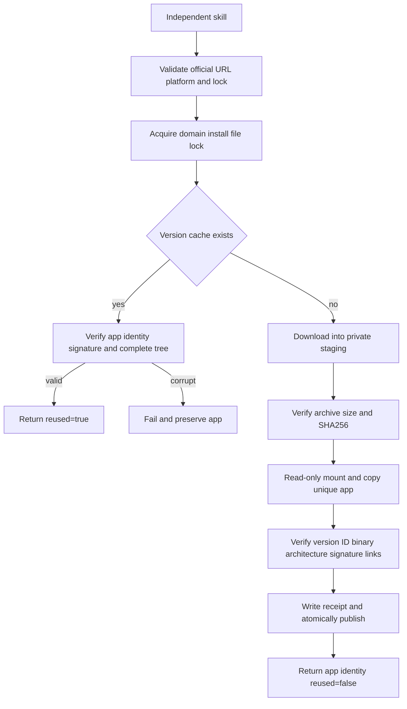

# Craft Desktop First-Use Architecture

> 2026-10-07. Scope: the standalone desktop installation component in four domain skill suites. This is source-candidate implementation; fixed-release skill installation and complete GUI acceptance remain open.

## 1. Entry and ownership

All 48 domain skills include their own `scripts/desktop.py`, `scripts/desktop.lock.json` and `references/desktop-install.md`. No sibling skill is required. Set `SKILL_DIR` to the actually loaded skill directory:

```bash
python3 -I -B "$SKILL_DIR/scripts/desktop.py" install
```

The JSON receipt returns actual app/executable paths, version, binary SHA256 and `reused`. Official desktop v0.2.0 is pinned for macOS arm64 separately from the maintained CLI. Matching version strings do not prove protocol compatibility. The default versioned user-data cache is `craft-runtimes/<domain>-desktop/<version>`; `--runtime-home` selects an isolated cache. ArtCraft retains child-domain skill receipts; this change adds neither ArtCraft desktop orchestration nor a Jianying adapter.

## 2. Install and recovery



Local `--archive` input must still match the complete pinned identity. Installed file hashes, symlink targets and receipt are rechecked; corrupt installs are never silently overwritten. Cross-process installation is serialized by a file lock. Failures clean only owned staging and detach only owned mounts; incomplete versions are not published. Installation does not modify PATH, overwrite user Applications, remove security attributes or launch applications.

## 3. Evidence and remaining gates

`tests/test_desktop_install.py` checks standalone resources, official URL constraints, unsupported-platform no-write behavior and bad-archive rejection. Native installation requires explicit `CRAFT_DESKTOP_FIRST_USE=1`; normal regressions do not download applications. Each native case copies exactly one skill into `.agents/skills`, uses an empty cache and downloads the public official DMG. It checks unchanged reuse, corrupt-receipt rejection, preserved application and unchanged skill resources.

The authoritative batch result is `docs/evidence/craft-desktop-source48-first-use-20261007.json`; do not claim batch acceptance if that report is missing or failed. Source-candidate evidence is distinct from installed fixed-release evidence.

Earlier investigation verified four official DMGs and Film live MCP `ui_inspect`, `ui_elements`, and 666 live command entries. Effect also passed isolated `EFFECTCRAFT_CONFIG_DIR`, signed desktop startup, pinned CLI bridge, 640 live entries and actual MCP `ui_inspect`; its owned app process was terminated. Photo and Vector startup/control authentication still require separate validation. UI MCP tools are not domain `command_run` operations; `exec ui.inspect` is not a substitute. Existing `commands.py --mode bridge` connects to an explicit active session and does not start or switch applications.

Existing domain OpenSpec 8.16/8.17 remain open for startup, fixed-release first use and GUI edit/save/reopen. The full command execution gate 8.3 remains open. Catalog coverage of 2639 entries is not execution acceptance of all 2639 commands.
