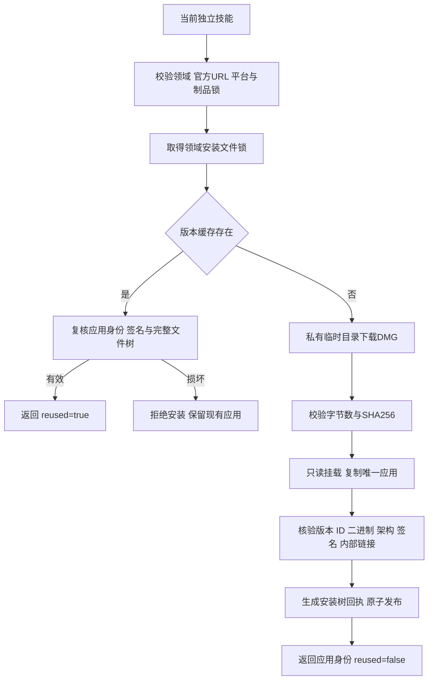

# Craft 桌面首次使用架构

> 2026-10-07。范围：四领域独立技能的桌面安装组件；候选源码实现，固定技能发布及 GUI 完整验收仍开放。

## 1. 入口与边界

四领域共 48 个技能均自带 `scripts/desktop.py`、`scripts/desktop.lock.json` 和 `references/desktop-install.md`。无需安装兄弟技能。设置 `SKILL_DIR` 为当前技能真实加载目录，然后执行：

```bash
python3 -I -B "$SKILL_DIR/scripts/desktop.py" install
```

返回实际应用路径、可执行文件路径、版本、二进制摘要和 `reused`。macOS arm64 桌面应用固定为官方 v0.2.0；维护 CLI 与桌面分别锁定，不能把相同版本号当作兼容性证明。默认缓存为用户数据目录下 `craft-runtimes/<domain>-desktop/<version>`；可用 `--runtime-home` 指定隔离目录。

ArtCraft 的编排技能沿用子领域技能安装回执；本次没有增加 ArtCraft GUI 调度接口，也没有增加剪映适配。

## 2. 安装过程与失败恢复



安装只下载锁定官方制品。`--archive` 可提供本地 DMG，但仍须匹配完整锁，不能绕过验证。对安装树中的文件、链接及回执进行复核；损坏版本不静默覆盖。跨进程共享缓存通过文件锁串行发布；失败只清理本次拥有的临时目录，卸载本次挂载点，不发布半成品。安装不修改 PATH、不覆盖 Applications 中的用户应用、不移除安全属性，也不启动应用。

## 3. 验证与后续门禁

`tests/test_desktop_install.py` 包含锁契约、错误官方 URL、错误平台不创建缓存、错误制品不发布版本测试。原生首次安装测试必须显式设置 `CRAFT_DESKTOP_FIRST_USE=1`，普通回归不会下载应用。每个原生案例只复制一个技能到 `.agents/skills`，以空缓存下载官方 DMG，验证重复安装不改变应用、损坏回执被拒绝且技能资源不变。

48 个源码技能测试的通过数量以 `docs/evidence/craft-desktop-source48-first-use-20261007.json` 为准；没有该报告或报告未通过时，不能声称批量通过。此证据不等于已发布技能安装验收。

已有调查验证四个官方 DMG，并验证 Film 的真实 MCP `ui_inspect`、`ui_elements` 和 666 条 live 目录。Effect 已通过独立 `EFFECTCRAFT_CONFIG_DIR`、签名桌面启动、固定 CLI bridge、640 条实际目录和真实 MCP `ui_inspect` 验证；测试应用已退出。Photo 与 Vector 的启动参数和控制认证须分别验证。UI MCP 工具与领域 `command_run` 接口不同，不能使用 `exec ui.inspect` 替代。`commands.py --mode bridge` 连接明确的活动会话，不自动启动或切换桌面。

沿用四领域 OpenSpec 的 8.16、8.17：桌面启动、固定发布首用、真实 GUI 编辑与保存重开尚未完成；8.3 全量命令执行门禁开放。2639 条目录覆盖不代表 2639 条命令全部运行通过。
