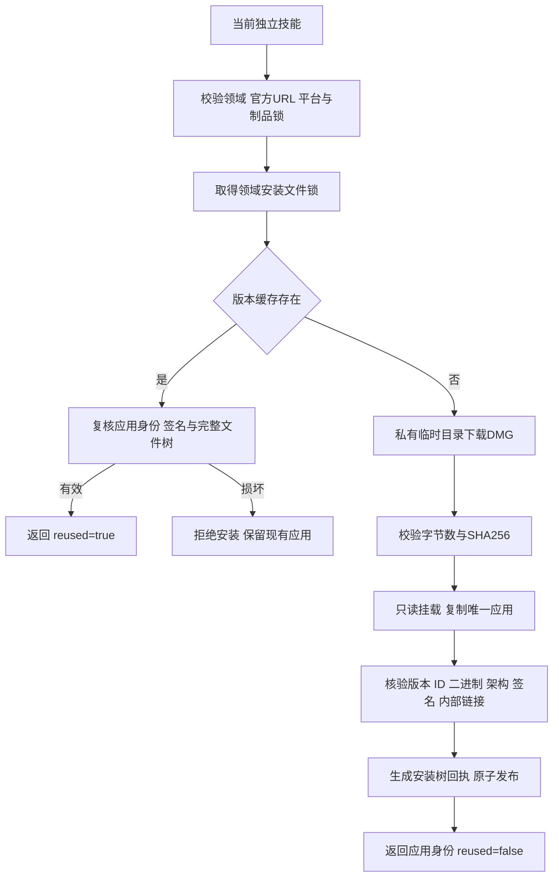
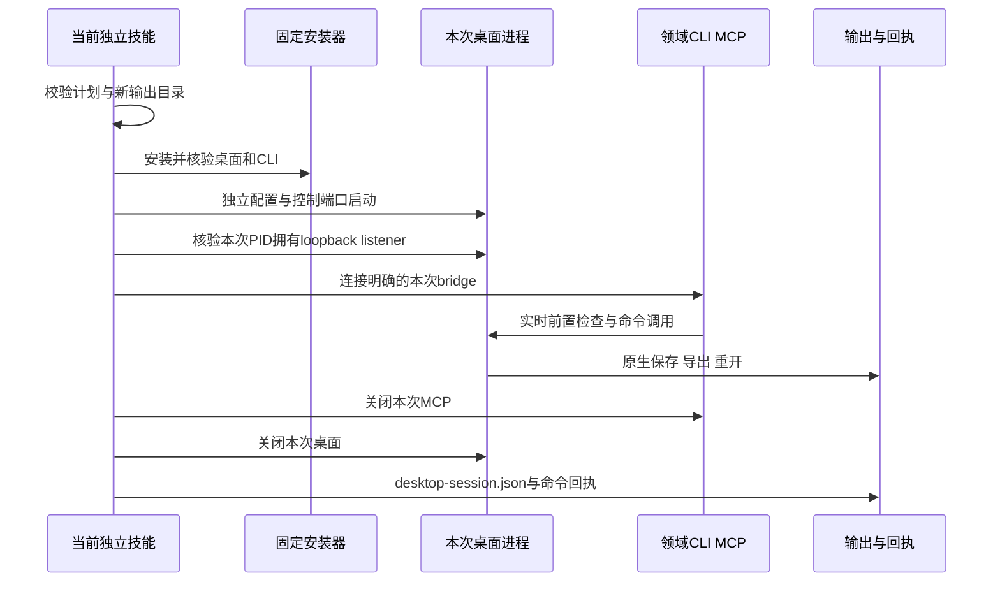

# Craft 桌面首次使用架构

> 2026-10-07。范围：四领域独立技能的桌面安装组件；候选源码实现，固定技能发布及 GUI 完整验收仍开放。

## 1. 入口与边界

四领域共 48 个技能均自带 `scripts/desktop.py`、`scripts/desktop.lock.json` 和 `references/desktop-install.md`。无需安装兄弟技能。设置 `SKILL_DIR` 为当前技能真实加载目录，然后执行：

```bash
python3 -I -B "$SKILL_DIR/scripts/desktop.py" install
```

返回实际应用路径、可执行文件路径、版本、二进制摘要和 `reused`。macOS arm64 桌面应用固定为官方 v0.2.0；维护 CLI 与桌面分别锁定，不能把相同版本号当作兼容性证明。默认缓存为用户数据目录下 `craft-runtimes/<domain>-desktop/<version>`；可用 `--runtime-home` 指定隔离目录。

ArtCraft 的编排技能沿用子领域技能安装回执；本次没有增加 ArtCraft GUI 调度接口，也没有增加剪映适配。

## 2. 安装过程与失败恢复



安装只下载锁定官方制品。`--archive` 可提供本地 DMG，但仍须匹配完整锁，不能绕过验证。对安装树中的文件、链接及回执进行复核；损坏版本不静默覆盖。跨进程共享缓存通过文件锁串行发布；失败只清理本次拥有的临时目录，卸载本次挂载点，不发布半成品。安装不修改 PATH、不覆盖 Applications 中的用户应用、不移除安全属性，也不启动应用。

## 3. 验证与后续门禁

`tests/test_desktop_install.py` 包含锁契约、错误官方 URL、错误平台不创建缓存、错误制品不发布版本测试。原生首次安装测试必须显式设置 `CRAFT_DESKTOP_FIRST_USE=1`，普通回归不会下载应用。每个原生案例只复制一个技能到 `.agents/skills`，以空缓存下载官方 DMG，验证重复安装不改变应用、损坏回执被拒绝且技能资源不变。

48 个源码技能测试的通过数量以 `docs/evidence/craft-desktop-source48-first-use-20261007.json` 为准；没有该报告或报告未通过时，不能声称批量通过。此证据不等于已发布技能安装验收。

已有调查验证四个官方 DMG，并验证 Film 的真实 MCP `ui_inspect`、`ui_elements` 和 666 条 live 目录。Effect 已通过独立 `EFFECTCRAFT_CONFIG_DIR`、签名桌面启动、固定 CLI bridge、640 条实际目录和真实 MCP `ui_inspect` 验证；测试应用已退出。Photo 与 Vector 的真实 bridge 已完成后续验证，见第 4 节；单技能自动启动仍待实施。UI MCP 工具与领域 `command_run` 接口不同，不能使用 `exec ui.inspect` 替代。`commands.py --mode bridge` 连接明确的活动会话，不自动启动或切换桌面。

沿用四领域 OpenSpec 的 8.16、8.17：源码自动启动及代表性保存重开已通过第 5 节验收；固定发布首用及完整 GUI 创作任务尚未完成；8.3 全量命令执行门禁开放。2639 条目录覆盖不代表 2639 条命令全部运行通过。

## 4. 四领域 live bridge 与 Vector 修复

[四领域运行证据](evidence/craft-four-desktop-live-bridge-20261007.json)记录签名桌面与固定 CLI 的真实连接。Photo 的认证 token 使用权限为 0600 的私有文件，测试结束删除；配置和读写根均隔离。Vector 使用 `VECTORCRAFT_NO_PREFS` 禁用偏好和恢复，测试仅操作隔离工程。所有测试拥有的应用进程均已退出。

| 领域 | GUI 检查工具 | CLI 连接 | 实际目录 |
| :--- | :--- | :--- | :--- |
| Film | `ui_inspect` | `mcp --bridge 127.0.0.1:PORT` | 666 |
| Effect | `ui_inspect` | `mcp --bridge PORT` | 640 |
| Photo | `ui_inspect` | `mcp --bridge 127.0.0.1:PORT`，token 文件及读写根 | 748 |
| Vector | `inspect_ui` | `mcp --connect 127.0.0.1:PORT` | 763 行；585 个反射命令需要一项明确别名映射 |

Vector 候选源码 bridge 模式把 `file.export` 映射到原生 `document.export`，并在回执同时保留 `command` 与 `backendCommand`。实时 enabled 检查使用实际命令，不绕过上下文。官方目录的 `file.place` 有引擎/UI 两个变体，只为这个已验证的组合选用引擎行；其他重复或缺失命令继续拒绝。headless 的别名和唯一性合同不变。

真实桌面案例完成新建、矩形、SVG 导出、原生保存、重开、检查六步；重开后的矩形仍为 x/y=8/8、宽高=24/24，工程无未保存修改，SVG 为有效 XML。Vector 回归通过 80 项，24 项环境测试跳过。这证明该案例及候选源码修复，不证明固定发布版已包含修复或全命令执行完成。单技能自动启动与生命周期管理已完成第 5 节源码验收，固定发布版仍待复验。

## 5. 独立技能自动启动与退出

48 个领域技能现均提供自有 `desktop_session.py`、`desktop.py run` 入口与 `examples/desktop-first-use.json`。设置当前技能真实目录 SKILL_DIR，执行：

```bash
python3 -I -B "$SKILL_DIR/scripts/desktop.py" run "$SKILL_DIR/examples/desktop-first-use.json" --output "$OUTPUT"
```

OUTPUT 必须尚不存在且父目录已存在；可用 `--runtime-home` 选择隔离缓存和 `--input NAME=PATH` 导入素材。结构、命令、引用、输入文件和平台先校验，然后由同一工作流安装固定桌面与 CLI。应用配置隔离在输出目录中，本地 listener 必须经 lsof 确认属于本次应用 PID 才连接 MCP。Photo 使用私有 0600 token 文件，GUI/CLI 读写根相同。工作流结束或失败，只关闭本次应用及 MCP；未知编辑不重试。



[48 技能源码冷启动证据](evidence/craft-owned-desktop-first-use-20261007.json)证明：每次仅复制一个技能到 .agents/skills、空公共缓存安装两类运行时、PID 归属检查、GUI 工作流、原生保存重开、技能文件不变和拥有的进程退出。各案例 5 步，Vector 为 6 步并验证导出别名。四领域回归通过 357 项，跳过 109 项环境依赖测试。规格 8.16 的源码组件已验证；8.17 固定发布安装、8.3 全量命令执行、Art GUI 编排及完整 V1 仍开放。
