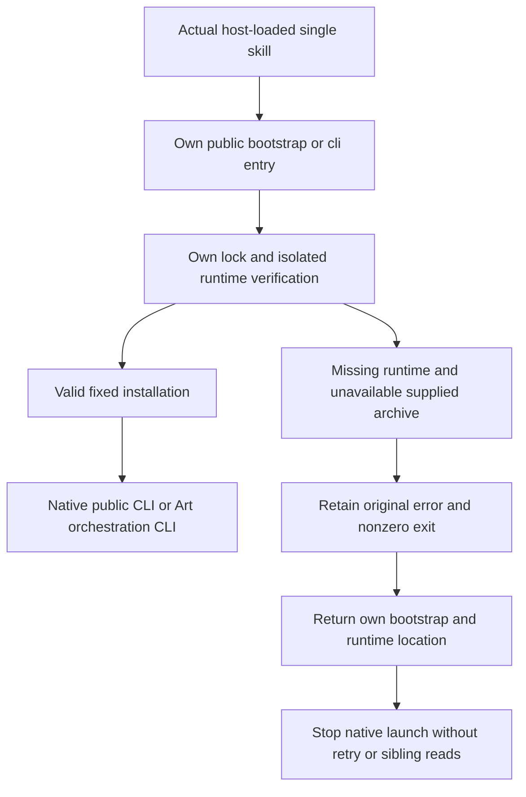

# Independent installation and own-skill recovery design

## Contract and current identity

This increment verifies fixed installation boundaries for five plugins and 64 standalone skills. Each domain `FC/EC/PC/VC-SK-002` has two scenarios: independent public CLI operation and an own-skill setup diagnostic when the runtime is missing. Each plugin retains its existing OpenSpec `establish-v1-plugin` authority.

The exact matrix is Film plugin dev.36 / source dev.35, Effect dev.36 / dev.34, Photo dev.35 / dev.33, Vector dev.33 / dev.31, and Art dev.107 / dev.80. Fixed locks bind skill, native CLI, Node and Art orchestration identities. This increment changes no runtime or skill release. Art explicitly depends on pinned Node and this project's orchestration package; its CLI is distinct from the upstream Tauri application.

## Calls and failure paths

The failure `dependencySetup` must contain the tool's setup skill name, this copy's actual `scripts/bootstrap.py` path, the requested runtime directory and `automaticRetry=false`. Native task failures must not be mislabeled as missing dependencies. Unknown/time-out results cannot qualify as the known failure tested here. The setup skill name supports named handoff; the self-contained recovery script works without a sibling installation.

## Fixed-copy verification

The maintainer tool `verify_setup_boundary.py` locates actual fixed Codex-installed copies from the isolated host receipt, verifies plugin identity and complete skill digests, and independently copies each skill beneath `.agents/skills`. Preserve originals. Each case uses a fresh runtime location, an explicitly nonexistent archive and `/usr/bin:/bin` PATH, executing both public bootstrap and CLI entries: 128 real failure cases.

A Python audit hook rejects reads/enumeration of original installed plugin trees, unexpected network calls and native launches. The Art launcher may start only its own Python bootstrap; that bootstrap is also directly audited in its separate case. This is not a general OS sandbox or proof of every child-process operation. Assert that the error identifies the supplied unavailable archive, the recovery path belongs to this skill, the runtime was initially missing, no installation receipt appears, and original/copied skill hashes remain unchanged.

Positive public cold installation retains the current matrix's 64 byte-identical skill records: 13 latest Photo records and 51 historical records. These are not new downloads this turn. The failure cases are new executions and cannot be inferred from positive success counts.

## Red/green evidence and formal tasks

Reconstruct historical domain launchers from exact Git files now: retain the current pinned installer/lock while replacing only cli.py with its pre-diagnostic historical file. The same unavailable archive causes a known setup failure, but four assertions fail because `dependencySetup` is missing. Record old commit and CLI hashes; this is a reconstructed single-file baseline, not an original historical run or full old-release acceptance.

All 128 current fixed-entry checks pass. New verifier tests first failed for missing implementation, then check valid diagnostics and reject success/unknown/retry/sibling/wrong-runtime and ambiguous JSON cases. Art maintainer regression: 101 tests, 96 passed, 5 conditional skips. Skips do not count as runtime acceptance.

[Fixed boundary evidence](evidence/craft-fixed-setup-boundary-20261008.json) binds the four domain positive/negative scenarios to full contract SHA fingerprints. Close only tasks 1.4, 1.5 and 1.6 for independent installation/dependency declarations. Art `AC-SK-002` adds source-lock, actual Skills CLI installation and linked-tree scenarios and stays open. CLI scene coverage, all native command contexts, GUI, models, creative quality and complete V1 remain separate.

Keep the requested absolute runtime path as defined by the launcher contract; forcing a resolved alias into a different string caused a verifier false rejection. The alias regression now passes.
