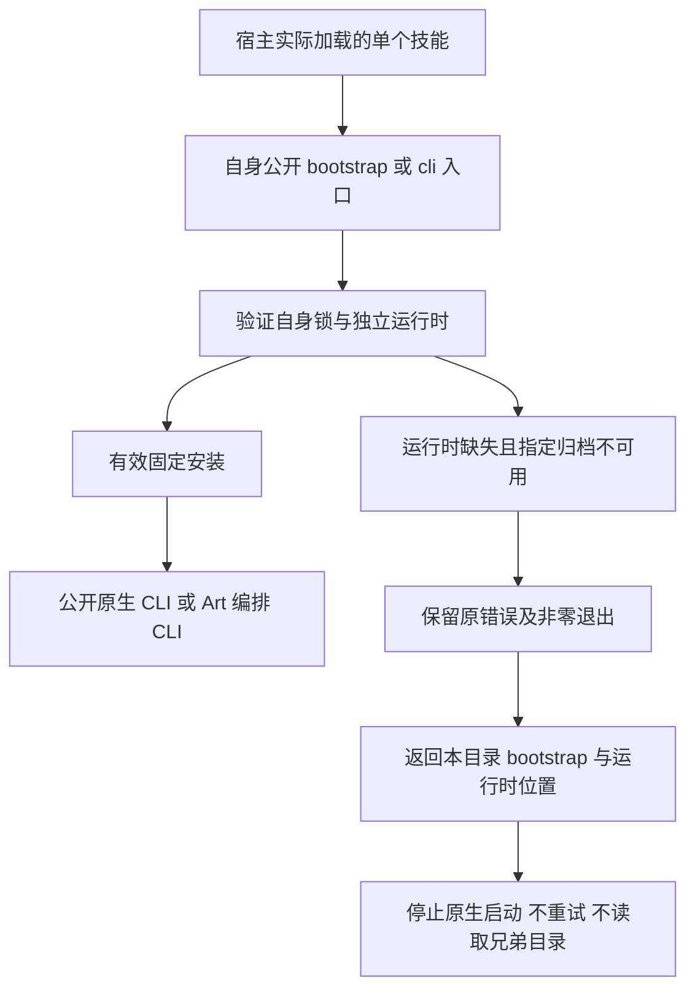

# 独立安装与本技能恢复入口技术方案

## 合同与当前身份

本增量核验五插件及 64 个配套技能的固定安装边界。四领域 `FC/EC/PC/VC-SK-002` 各有两个场景：公开 CLI 独立使用，以及运行时缺失时返回本技能 setup 路径。规格、任务和来源仍属于各插件既有 OpenSpec `establish-v1-plugin`，不建立新规格体系。

当前矩阵：Film 插件 dev.36／技能源 dev.35，Effect dev.36／dev.34，Photo dev.35／dev.33，Vector dev.33／dev.31，Art dev.107／dev.80。技能、原生 CLI、Node、Art 编排包的版本及摘要由固定锁绑定；本增量不改变这些运行时或技能发行。Art 使用本项目编排 CLI，独立技能明确声明固定 Node 与编排包，不冒充上游 Tauri 应用 CLI。

## 调用与失败路径

失败回复中的 `dependencySetup` 必须包含本工具 setup 技能名称、本副本 `scripts/bootstrap.py` 的真实路径、当前请求的运行时目录与 `automaticRetry=false`。原生操作失败不能被误报成依赖缺失；超时或未知结果不能被验收器接受为本次已知失败。setup 技能名称用于按名称交接，自包含恢复脚本不依赖其是否同时安装。

## 固定副本边界验证

维护工具 `verify_setup_boundary.py` 从实际隔离 Codex 宿主收据定位固定安装副本，核对插件身份与全技能树摘要，分别复制每个技能到独立 `.agents/skills` 目录。原安装副本保留。每项使用全新运行时位置、显式不存在的归档和 `/usr/bin:/bin` PATH，实际执行自身 bootstrap 与 cli 两个入口，共 128 个失败案例。

Python 审计钩子拒绝原安装插件树的文件读取和目录枚举，拒绝意外网络连接和原生进程。Art launcher 允许且仅允许启动自身 Python bootstrap；其 bootstrap 入口另行直接受审计验证。该钩子并非通用 OS 沙箱，不能推广成所有子进程行为证明。测试同时核对原始错误确为指定不可用归档、恢复路径属于本技能、运行时此前不存在、未产生安装收据，以及原安装／复制技能树未改变。

正向公开空缓存安装复用当前固定矩阵已有的 64 条完整技能摘要一致记录：13 条 Photo 最新运行与其余 51 条保留历史运行。这些不是本轮新增下载。实际失败路径为本轮新运行，不能用正向计数替代。

## 红绿证据与正式任务

四领域历史 launcher 的原始 Git 文件在本轮重建：保持当前固定 installer／lock，仅替换为诊断修复前的历史 cli.py。相同不可用归档触发已知安装失败，但缺少 `dependencySetup`，四条断言均失败。记录历史提交及 CLI 摘要，明确这是当前重建的单文件基线，不能视为过去原始测试或完整旧发行验收。

当前固定技能的 128 个入口检查全部通过。新增验收器测试先因缺少实现失败，再验证正确诊断、成功／unknown／重试／兄弟路径／错误运行时及不明确 JSON 的拒绝。Art 维护回归 100 项：95 通过、5 条件跳过；跳过不算实际验收。

四领域正向／负向场景与完整合同 SHA 绑定到[固定边界证据](evidence/craft-fixed-setup-boundary-20261008.json)，关闭各自任务 1.4、1.5、1.6，仅对应独立安装与依赖声明。Art `AC-SK-002` 另有安装来源、实际 Skills CLI 安装和副本链接等场景；本轮不关闭该需求。CLI 场景体系、全部原生命令上下文、GUI、模型、创作质量和完整 V1 继续独立验收。
