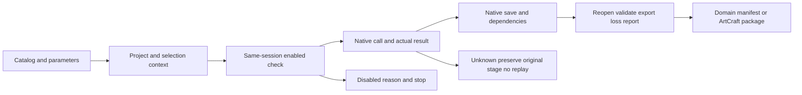

Current fixed releases: domain source21/plugin23; Art source62/plugin89 (runtime83). Isolated installation, immutable identities and discovery of all58 skills pass. Desktop cold batches remain in progress; exhaustive2639 commands and fullV1 are not accepted. [Evidence](evidence/craft-fixed-desktop-release-host-20261007.json).

# Complete command queries, invocation and native delivery

The four pinned reflected registries own the complete native command catalog. Domain workflows retain their convenience operations and add `native.command`; their convenience-operation counts no longer bound the number of native IDs that can be attempted.

| Tool | Complete catalog | Workflow operations, including gateway | Skills | Plugin |
|---|---:|---:|---|---|
| FilmCraft | 666 | 18 | dev.21 | dev.23 |
| EffectCraft | 640 | 22 | dev.21 | dev.23 |
| PhotoCraft | 748 | 33 | dev.21 | dev.23 |
| VectorCraft | 585 | 28 | dev.21 | dev.23 |
| ArtCraft | 2639 domain entries | Domain DAG orchestration | dev.62 | dev.89 / runtime83 |

`workflowMapped` marks convenience-operation mapping only. A false value does not disable `native.command` or establish a failed native execution. The gateway uses pinned membership and actual live context.

Every one of the 48 domain skills carries its own installer, query/call scripts, verbatim parameter reference, actual MCP schemas and creation/revision examples. All ten Art skills contain the complete domain index and independent installation entry. Scripts do not import sibling skill directories.

## First use and entry selection

Set `SKILL_DIR` to the actual directory loaded by the host: user/project `.agents/skills/<name>`, plugin `skills/<name>`, or the host cache. Call that directory's public scripts. Installers verify the pinned published content.

```bash
python3 -I -B "$SKILL_DIR/scripts/commands.py" list --filter layer
python3 -I -B "$SKILL_DIR/scripts/commands.py" describe layer.setBlendMode
```

This is an EffectCraft query example and requires no download. Other domains use their actual IDs. Establish object references, selection, assets, units and parameters before execution.

| Goal | Entry | Result |
|---|---|---|
| Native command or MCP tool calls | `commands.py check / run` | Actual step results and journal; save/export are explicit plan operations |
| Editable and verified delivery | `workflow.py` with `native.command` | Native project, collected assets, reopening, preview/export, loss report and manifest |
| Application interactions | `commands.py run --mode bridge --connect …` | Running application's real context; GUI acceptance tracked separately |
| Mixed project | ArtCraft public planner/runner and pinned adapters | DAG, lineage, revisions, budget, recovery and package |



## Executable EffectCraft gateway example

```bash
python3 -I -B "$SKILL_DIR/scripts/workflow.py"   "$SKILL_DIR/examples/native-workflow.json"   --output /absolute/new-effect-delivery   --runtime-home /absolute/empty-runtime
```

The example creates a 32×32 composition and a shape, then calls native `layer.setBlendMode`. It delivers `.ecproj`, preview, operation records and verification files. The output directory must not exist. First use installs the public locked CLI. FilmCraft's corresponding example additionally requires `--asset still=/absolute/input.png`. PhotoCraft edits layer properties; VectorCraft edits fill; both retain native projects.

```json
{
  "command": "native.command",
  "params": {
    "command": "layer.setBlendMode",
    "params": {"layers": [{"$ref": "badge.layer"}], "mode": "Multiply"}
  }
}
```

Query the actual ID and parameters first. Inner `$ref` uses earlier actual results; outer `as` can bind actual returned objects. Schema text is not a JSON parameter object.

For revisions use `workflow.py PLAN --source /absolute/original-delivery --output /absolute/new-revision`, binding the original project SHA256 and explicit edits. Reopening can lose selection: Film `timeline.select` and Effect `layer.select` establish the explicitly requested targets. The original delivery is preserved. Paired `examples/commands-revision-create.json` / `examples/commands-revision.json` are `commands.py` plans; do not mix their format with workflow plans.

## ArtCraft and runtime boundaries

Art skill directories use their own domain query component:

```bash
python3 -I -B "$SKILL_DIR/scripts/domain_commands.py" list --domain effectcraft
python3 -I -B "$SKILL_DIR/scripts/domain_commands.py" describe effectcraft layer.setBlendMode
python3 -I -B "$SKILL_DIR/scripts/workflow.py" /absolute/mixed-plan.json --output /absolute/new-project --owner local-user --authorization TASK_SCOPE --asset voice=/absolute/voice.wav
```

Mixed plans declare pluginId, dependencies, domain payload.plan and artifact bindings. Put native gateways in payload.plan.operations. The public installer binds runtime identity; do not copy runtimeIdentity from another test session. Adapt the skill's brand plan to actual requirements and assets. TASK_SCOPE references the already authorized task scope.

ArtCraft dev.88 publicly installs pinned runtime83 and Film19/Effect19/Photo19/Vector19. Its trusted launcher locks `native_workflow.py`, `commands.py`, `command-coverage.json` and existing scripts. Plans cannot choose executors or replace scripts. Actual native saving, dependency collection, exports and loss reports must pass before a result becomes a DAG delivery.

GUI commands remain in the complete catalog even when disabled in a headless session; use the actual running application and explicit bridge mode. Native implementation, project, selection and permission guards remain enforced. Disabled commands report their reason; parameter errors stop; unknown edits preserve the stage and are not replayed. Catalog coverage is distinct from exhaustive 2639-command execution acceptance.

Fixed first-use and joint-gateway evidence: `evidence/codex-native-gateway-first-use-20261007.json` beside this guide. Frozen skill references marked source candidate describe their authoring stage; current acceptance requires the exact version, file hashes and evidence. Full per-command, GUI, model and V1 gates remain separately tracked.
