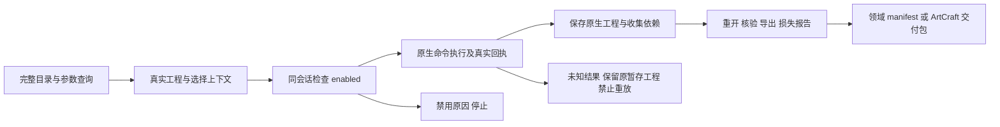

# 完整命令的查询、调用与工程交付

四领域的反射目录是完整命令入口的事实源。公开创作工作流仍提供领域快捷操作，并增加 `native.command`：因此其快捷操作数不再限制能够尝试调用的原生命令数量。

| 工具 | 完整目录 | 工作流操作（含网关） | 固定技能源 | 固定插件 |
|---|---:|---:|---|---|
| FilmCraft | 666 | 18 | dev.19 | dev.21 |
| EffectCraft | 640 | 22 | dev.19 | dev.21 |
| PhotoCraft | 748 | 33 | dev.19 | dev.21 |
| VectorCraft | 585 | 28 | dev.19 | dev.21 |
| ArtCraft | 2639 个领域目录条目 | 编排上述领域节点 | dev.61 | dev.88，runtime dev.83 |

目录中的 `workflowMapped` 只标记领域快捷操作映射；`false` 不表示无法使用 `native.command`，也不表示原生命令已经运行失败。网关依据完整固定 ID 及实时原生上下文调用。

每个领域的任意单技能均自带查询、调用、安装脚本、完整命令参考、参数原文、实际 MCP 工具 schema、创建及返工示例。共 48 项领域技能；ArtCraft 的十项技能均有完整领域目录与独立安装入口。无需通过兄弟技能目录访问脚本。

## 首次使用及选择入口

`SKILL_DIR` 指向宿主实际加载的技能目录：用户／项目 `.agents/skills/<name>`、插件内 `skills/<name>` 或宿主安装缓存。使用该目录内的公开脚本；固定发布摘要由安装器核对。

```bash
python3 -I -B "$SKILL_DIR/scripts/commands.py" list --filter layer
python3 -I -B "$SKILL_DIR/scripts/commands.py" describe layer.setBlendMode
```

以上是 EffectCraft 查询示例，不下载运行时。其他工具使用其目录中的真实命令 ID。查询后确定目标原生对象、选择状态、素材引用、单位与参数，再选以下入口。

| 目标 | 入口 | 结果 |
|---|---|---|
| 原生命令／MCP 工具调用 | `commands.py check / run` | 每步真实结果、journal、成功或失败回执；保存／导出需显式写入计划 |
| 可编辑工程和核验后的交付 | `workflow.py`，原生操作嵌入 `native.command` | 原生工程、素材清单、重开记录、预览／导出、交换损失与 manifest |
| 应用交互命令 | `commands.py run --mode bridge --connect …` | 运行中应用的真实上下文；需要单独 GUI 验收 |
| 多领域混合项目 | ArtCraft 公开规划／运行入口及固定领域适配器 | 依赖 DAG、版本血缘、返工、预算、恢复与交付包 |



## EffectCraft 可直接执行的网关样例

```bash
python3 -I -B "$SKILL_DIR/scripts/workflow.py"   "$SKILL_DIR/examples/native-workflow.json"   --output /absolute/new-effect-delivery   --runtime-home /absolute/empty-runtime
```

此样例建立 32×32 合成，创建形状并以网关执行 `layer.setBlendMode`，产生 `.ecproj`、预览、操作记录和交付核验文件。输出目录必须不存在；首次自动安装公开锁定 CLI。FilmCraft 对应样例还需 `--asset still=/absolute/input.png`。PhotoCraft 修改图层属性，VectorCraft 修改填色，均保留原生工程。

网关结构如下，内层原生命令 ID 与参数须先查询。`$ref` 引用前序真实结果，外层 `as` 可绑定真实返回值；不能将工具 schema 文本当作参数 JSON。

```json
{
  "command": "native.command",
  "params": {
    "command": "layer.setBlendMode",
    "params": {"layers": [{"$ref": "badge.layer"}], "mode": "Multiply"}
  }
}
```

局部返工使用 `workflow.py PLAN --source /absolute/original-delivery --output /absolute/new-revision`；计划包含原工程 SHA256 与确切修改。打开工程后选择状态可能丢失，Film 使用 `timeline.select`、Effect 使用 `layer.select` 恢复计划明确指定的目标。原交付目录保持不变。完整成对返工操作参考技能内 `examples/commands-revision-create.json` 和 `examples/commands-revision.json`，其入口为 `commands.py`，不要把两种计划格式混用。

## ArtCraft 与运行边界

ArtCraft 技能目录使用自己的领域查询组件：

```bash
python3 -I -B "$SKILL_DIR/scripts/domain_commands.py" list --domain effectcraft
python3 -I -B "$SKILL_DIR/scripts/domain_commands.py" describe effectcraft layer.setBlendMode
python3 -I -B "$SKILL_DIR/scripts/workflow.py" /absolute/mixed-plan.json --output /absolute/new-project --owner local-user --authorization TASK_SCOPE --asset voice=/absolute/voice.wav
```

混合计划声明 `pluginId`、依赖、领域 `payload.plan` 与产物绑定；领域原生操作写入 `payload.plan.operations` 的网关。运行时身份由公开安装器绑定，不复制另一个测试会话的 `runtimeIdentity`。以技能内品牌计划为结构基础，再按实际需求和源素材修改；`TASK_SCOPE` 是本次已经授权的任务范围引用。

ArtCraft dev.88 的公开安装器固定 runtime83、Film19、Effect19、Photo19、Vector19，并为 `native_workflow.py`、`commands.py`、`command-coverage.json` 与既有启动文件建立摘要锁。任务不能选择执行器或替换脚本。领域成功回执仍须通过原生保存、依赖、导出与损失报告校验才能成为 DAG 交付。

目录中的 GUI 命令不因 headless 当前禁用而被删除；使用实际运行中的应用和明确 bridge 模式。原生命令受其实现、当前工程、选择和权限约束；禁用时报告原因，参数错误停止，未知结果保全且不重放。完整目录覆盖不等于全部 2639 条命令的运行验收。

固定首用与网关联合验收：见同目录 `evidence/codex-native-gateway-first-use-20261007.json`。冻结技能参考中“source candidate”描述的是编写时状态；当前版本是否通过固定安装验收以版本、文件摘要及此证据为准。完整逐命令、GUI、模型与完整 V1 门禁保持单独记录。
