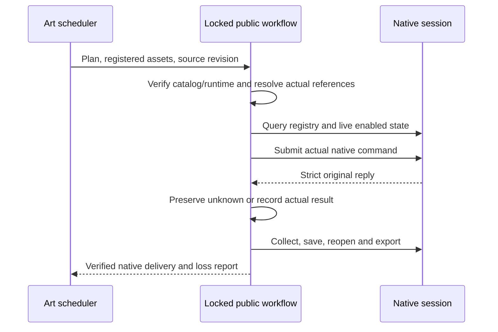

# Craft complete native workflow gateway architecture

The source candidate adds explicit native.command operations to all four domain workflows, allowing the existing Art public workflow adapter to keep its dependency collection, native save/reopen, actual export and exchange-loss delivery contract. Immutable releases do not yet include this candidate; full DAG gate6.51 remains open.

The wrapper params contains exactly command and params. Unknown IDs, custom executor fields and non-finite parameters are rejected before edits. The helper uses the skill-local complete command parser and pinned runtime catalog. Live enabled state is checked in the same session; reopening a source may require explicit selection operations. No silent selection or alternate-session fallback occurs.

Every submitted native operation updates preserved-stage state before receiving or parsing the reply. Duplicate keys, malformed/non-finite JSON, native semantic errors and uncertain responses cannot become success. Original staged native projects remain recovery inputs and are never automatically replayed. Vector preserves its portable command/params receipt convention; image attachments stay inside the current staging root.

Art requires checksummed helper, command parser and command catalog files when a plan requests native.command. Setup derives this lock only from verified domain bundles; old bundles cannot advertise the gateway. Existing mapped operations remain compatible, and payloads cannot choose a script or interpreter.

Actual Film speed revision exposed a historical normal-speed-only delivery guard. Source media consumption is now verified using timeline duration times absolute playback speed, retaining exact timebase and source checks. Invalid or zero speed is rejected; this does not establish acceptance for all time remapping commands.

Coverage validation, disabled/unknown tests, four independent empty-cache native delivery/revision samples, actual Art scheduler samples, immutable installed release, full mixed revision/recovery/package and exhaustive2639/GUI/model acceptance remain separate gates. Candidate evidence does not close full6.51.
