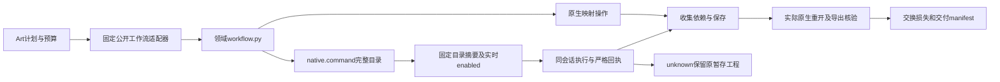

# Craft完整命令工作流网关架构

当前源候选扩展四领域workflow.py，使Art既有公开工作流适配器可以调度显式native.command，继续采用原生工程、收集素材、保存重开、导出和交换损失合同。固定发行版尚未包含此候选；完整DAG门禁6.51保持开放。

网关params恰好是command与params；真实对象引用由原工作流绑定解析。参数语法保持原生API，未知ID、额外执行器字段、非有限值在编辑前拒绝。helper读取本技能的固定完整目录，要求原生摘要与runtime.lock一致，执行前查询实时完整目录及enabled，不凭反射目录推测状态。Film／Effect源工程重开需要显式重选对象，不能默默改变用户选择。

严格解析来自本技能commands.py，不跨技能导入私有模块。每次提交先更新preserved_stage lastAttempt，确认回复后记录原生命令与真实结果；重复JSON键、非法数值、断连及歧义回复不得成为成功。Vector沿用command／params回执形状以保留分发记录清理；图片附件使用本次暂存目录。

Art适配器遇到native.command时要求锁定native_workflow.py、commands.py、command-coverage.json。setup只从已校验的领域包生成锁；旧包缺少网关时拒绝使用该能力。正常受约束操作保持兼容，用户不能在payload选择解释器或脚本。

Film此前将所有非1倍速片段判成范围错误。网关的真实返工样例暴露该缺陷，现按时间线时长乘绝对播放速率核验源媒体消耗范围，保留原时间基与输入摘要。零或非法速率仍拒绝，不能把这一检查当作所有时间重映射命令验收。

验收层次：固定目录全部ID的结构验证、disabled／unknown边界、四个独立技能从空缓存原生创建及源工程返工、Art调度器原生候选样例、固定插件安装、完整四域联动与恢复、2639条逐项及GUI／模型验收分别记录。候选通过不能关闭完整6.51。
