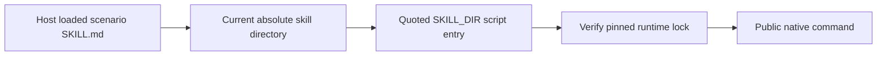

# Scenario skill installation paths

Each first-use example resolves the directory of the SKILL.md actually loaded by the host. Its user, project and plugin examples must name that same skill. A separately installed scenario skill must not require a sibling CLI skill.

Six examples across four domains previously named their generic CLI sibling. The correction changes only those path examples and aligns two suite runtime-version records with their existing locks; no native executable or runtime archive changes. The existing path check now rejects sibling examples; suite checks require each runtime lock to match suite metadata.

Validation copies all 54 domain skills into three layouts containing spaces and runs 474 documented help invocations without installation side effects. Source regressions pass with conditional native tests reported separately. [Candidate evidence](evidence/scenario-own-path-candidate-20261008.json). Fixed-tag plugin installation and actual cold runtime use remain separate release gates; this proof does not establish creative tasks or complete V1.
