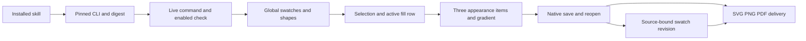

# VectorCraft gradient and multiple appearance architecture

All 585 commands remain available through `commands.py list/describe/run`. Public workflows invoke native IDs through `native.command`. This increment adds tested creation and revision plans that retain native projects, explicit selection state and independent skill resources.

Every standalone skill contains `appearance-gradient-create.json`, `appearance-gradient-revise.json` and `references/appearance-gradient.md`. Command catalog `usageRecipes` paths belong to that domain skill root. A missing recipe does not disable a command or establish its acceptance.

| Commands | Required context | Observed behavior |
| --- | --- | --- |
| `swatch.new/edit/list` | Actual returned swatch names, global links in gradient stops | Reopened swatch revision changes target paint |
| `appearance.addFill/setItem` | Native paint-order index; transparent white top fill | Three items and top fill preserved |
| `appearance.setActiveItem`, `gradient.selectStop` | Explicit `select.set`, active fill row and stop index | Real native selection context |
| `paint.setGradientGeom/editGradient` | Explicit object IDs/item; paired start and end coordinates | Native geometry/direction edit; one endpoint rejected |

Explicit IDs do not replace live selection or GUI prerequisites. The gateway retains native parameter syntax while the workflow manages aliases, stage results, project reopening and delivery. Revision checks `expectedProjectSha256`, writes a new delivery and preserves the original. Copy the revision example to a user-owned plan before filling the digest; installed resources stay unchanged.

Source-candidate evidence covers 12 independent skills starting with empty runtimes: installation, native creation/reopening, linked swatch revision and invalid-geometry rejection. Regression: 96 total, 73 passed, 23 optional skips. [Evidence](evidence/vector-appearance-candidate-20261007.json). It does not establish the new fixed installed host or Art distribution.

Decoded PNG target pixels change while control node/pixels, target geometry/IDs, top fill and original delivery remain unchanged. SVG contains a real `linearGradient`. PDF validation observes the header only. Cross-editor PDF appearance/editability, GUI, exhaustive 585-command execution and full V1 acceptance remain open.

Fixed release validation: installed plugin `v0.1.0-dev.21` / source `v0.1.0-dev.19` passes the same 12 cold native appearance cases; all 58 installed identities remain unchanged, no loading errors. Four plugin tag CI checks pass; both public ZIPs match exact tagged Git archives. Updated Art distribution remains pending. [Evidence](evidence/codex-vectorcraft-gradient-first-use-20261007.json).
