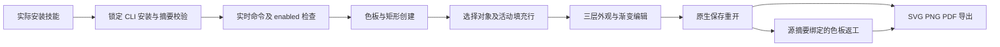

# VectorCraft 渐变与多重外观架构

完整 585 项命令仍由 `commands.py list/describe/run` 提供；公开工作流可通过 `native.command` 调用原生命令。本增量提供有实际验证的高级外观场景，将创建、选择状态、保存与返工串成可复用计划。技能在实际 `.agents/skills` 或插件缓存位置运行，使用自己的 `scripts/`、`examples/` 与 `references/`，不依赖兄弟技能。

每项独立技能都携带 `appearance-gradient-create.json`、`appearance-gradient-revise.json` 与 `references/appearance-gradient.md`。目录的 `usageRecipes` 指向当前领域技能自身的示例；没有场景引用的命令仍可通过完整调用入口使用，不能据此宣称它已经验收。

| 原生命令 | 参数与前置状态 | 验证结果 |
| --- | --- | --- |
| `swatch.new` / `swatch.edit` / `swatch.list` | 使用返回的实际色板名称；全局色板链接写入渐变停止点 | 保存重开后返工色板改变目标渐变 |
| `appearance.addFill` / `appearance.setItem` | `index` 按原生 paint-order；第三项为白色透明叠加填充 | 三项外观数量及顶层填充保留 |
| `appearance.setActiveItem` / `gradient.selectStop` | 先 `select.set`，再指定活动填充行和停止点 | 在原生选择上下文中执行 |
| `paint.setGradientGeom` / `paint.editGradient` | 明确 `ids` / `item`；几何 `start` 与 `end` 成对给出 | 原生坐标与渐变方向设置；单端点拒绝 |

采用显式对象 ID 不会替代 GUI 或活动选择状态。`native.command` 的内部参数保持原生语法，外层工作流处理绑定引用、阶段结果与交付。创建计划保留可编辑 `.vectorcraft`；返工计划从源交付绑定对象，校验 `expectedProjectSha256`，输出新目录，原交付保持不变。使用者复制返工示例到自己的计划位置后填摘要，不改安装技能。

源候选验证：12 项独立技能分别从空运行时安装，创建、保存重开、改色返工和错误参数拒绝通过；96 项回归中 73 通过、23 为明确可选跳过。[候选证据](evidence/vector-appearance-candidate-20261007.json)。固定宿主及 Art 新领域分发尚未由本证据确认。

PNG 实际解码且目标像素改变；无关联控制对象 JSON 与像素、目标几何与 ID、顶层叠加填充和原交付摘要不变。SVG 观察到实际 `linearGradient`；PDF 仅确认文件头结构。PDF 跨编辑器视觉和可编辑性、GUI、全部 585 命令逐项执行以及完整 V1 仍需独立验收。

固定版本验证：插件 `v0.1.0-dev.21` / 技能源 `v0.1.0-dev.19` 的 12 项实际安装技能再次通过空运行时原生创建与返工，58 项安装身份不变、无加载错误；四项插件标签 CI 通过，两个公开 ZIP 与标签 Git archive 摘要一致。Art 更新分发仍待验证。 [Evidence](evidence/codex-vectorcraft-gradient-first-use-20261007.json).
