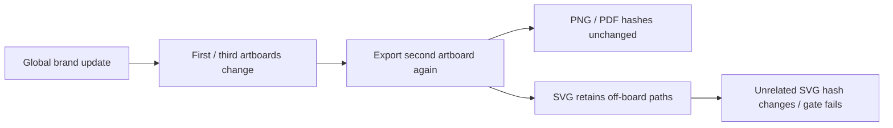

# VectorCraft multi-artboard SVG isolation gap

Fixed plugin dev.8 / skills dev.7 / native CLI 0.2.0 fails actual single-export-skill cold first use. Three artboards have sizes 128×96, 80×64 and 96×128 with different origins. The first and third use a shared global brand token; the second holds an unrelated green icon.

Independent Pillow / PyMuPDF checks confirm every output dimension, center color, transparent PNG corner, white PDF corner and absence of PDF raster images in both revisions. SVG viewBoxes are correct with no image elements. The subsequent unaffected-byte gate fails: the second SVG retains negative-coordinate and off-board brand paths whose colors change. PNG and PDF bytes remain identical. Two actual failures took 6.718 and 6.186 seconds. [Installed failure evidence](evidence/installed-artboard-export-failure.json).

CodeGraph locates upstream `crates/engine/src/cmd/fileio/export.rs::export_source`: the default exports the entire document; selectedOnly filters selected objects. `select.rs::all_on_artboard` uses geometric intersections of selectable objects, excluding locked content. Applying this selection globally would omit locked objects and is insufficient as a complete repair.

A repair must isolate board assets while preserving visible locked content, stroke/effect extents, groups/clipping and empty boards, or reuse outputs only after proving their native dependencies unchanged. Weakening assertions, comparing rendered pixels alone or deleting arbitrary paths cannot establish a repair. No fix is implemented or published; task 4.22 and full board/brand requirements remain open. Earlier PNG token evidence retains its original scope.

The independent source driver `tests/test_artboard_exports_first_use.py` uses an installed skill, an empty runtime and public native downloads. The default offline suite explicitly skips it: 28 passes and 16 skips out of 44 tests do not supersede the actual failure.
