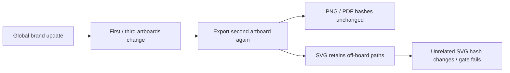
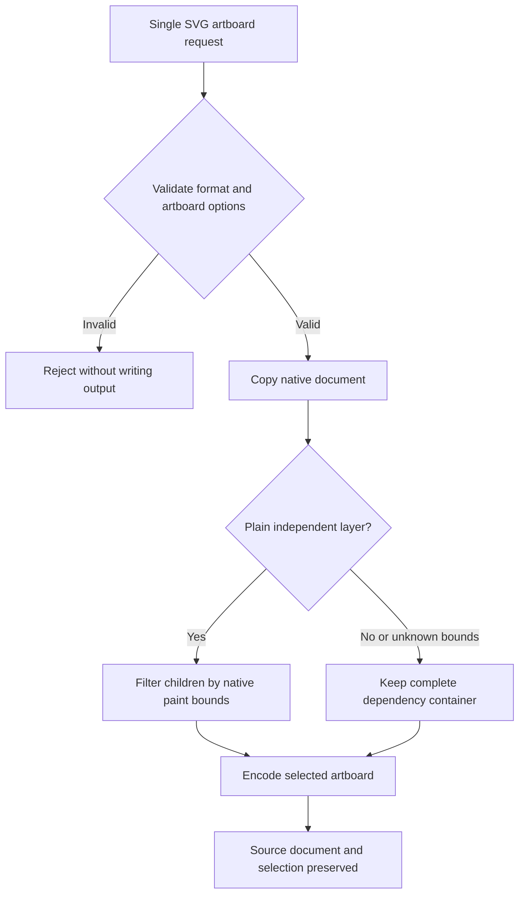

# VectorCraft multi-artboard SVG isolation gap

Fixed plugin dev.8 / skills dev.7 / native CLI 0.2.0 fails actual single-export-skill cold first use. Three artboards have sizes 128×96, 80×64 and 96×128 with different origins. The first and third use a shared global brand token; the second holds an unrelated green icon.

Independent Pillow / PyMuPDF checks confirm every output dimension, center color, transparent PNG corner, white PDF corner and absence of PDF raster images in both revisions. SVG viewBoxes are correct with no image elements. The subsequent unaffected-byte gate fails: the second SVG retains negative-coordinate and off-board brand paths whose colors change. PNG and PDF bytes remain identical. Two actual failures took 6.718 and 6.186 seconds. [Installed failure evidence](evidence/installed-artboard-export-failure.json).

CodeGraph locates upstream `crates/engine/src/cmd/fileio/export.rs::export_source`: the default exports the entire document; selectedOnly filters selected objects. `select.rs::all_on_artboard` uses geometric intersections of selectable objects, excluding locked content. Applying this selection globally would omit locked objects and is insufficient as a complete repair.

A repair must isolate board assets while preserving visible locked content, stroke/effect extents, groups/clipping and empty boards, or reuse outputs only after proving their native dependencies unchanged. Weakening assertions, comparing rendered pixels alone or deleting arbitrary paths cannot establish a repair. A native candidate repair now exists; the maintained native runtime is published, while repaired immutable skill/plugin snapshots are still pending. Task 4.22 and full board/brand requirements remain open. Earlier PNG token evidence retains its original scope.

The independent source driver `tests/test_artboard_exports_first_use.py` uses an installed skill, an empty runtime and public native downloads. The default offline suite explicitly skips it: 28 passes and 16 skips out of 44 tests do not supersede the actual failure.

## Native candidate repair

The maintained CLI candidate `0.2.0-craft.1` is based on upstream `90e022b0c05f12171a4e9bebe0894fa62f7bc95c`. Its additive `artboardContentOnly` option applies only to a single SVG/SVGZ artboard. It reuses the native renderer's paint bounds, retains locked visible art and keeps dependency containers intact. Plain layers without appearance, clipping, masks, blending, wrap or uncertain child bounds can filter children. Groups, clipping containers and uncertain paint bounds remain conservative; retaining a cross-board group does not imply independent member exports. Invalid indices and conflicting selection/range options are rejected, while the legacy option-off behavior is preserved.

954 engine library tests passed, including six isolation cases; all 12 CLI integration tests also passed. A single copied export skill with an empty runtime installed an explicitly supplied local candidate archive, created three artboards, exported nine SVG/PNG/PDF assets and repeated the exports after a global brand-color edit. Independent Pillow/PyMuPDF checks passed, and the unrelated board's three export formats stayed byte-identical. Invalid board and output-reuse rejection gates also passed. The run took 1.207 seconds; it is local candidate evidence, not public release download evidence. The source suite passed 30 tests with 16 deliberate skips. [Candidate evidence](evidence/native-artboard-svg-candidate-20261006.json).

The independent skill source stores `runtime/patches/artboard-svg-isolation.patch` and `runtime/artboard-svg-isolation-patch.json`; the patch reproduces all six modified files exactly from the pinned upstream source. All twelve skill installers now recognize the maintained version suffix and restrict native downloads to the official VectorCraft or owned VectorCraft skill repository's release paths. Published skill/plugin snapshots still install official 0.2.0. Working-tree locks and SVG workflow options now target the maintained runtime. Publishing immutable skill/plugin snapshots, repeating fixed public first-use acceptance and updating the ArtCraft bundle remain required before task 4.22 can close.

## Published maintained native runtime

The release-profile `0.2.0-craft.1` CLI is now published under the independent skill repository. The working-tree export skill cold-downloaded it from HTTPS and passed the three-artboard task in 4.970 seconds, including unaffected SVG/PNG/PDF bytes and source/skill preservation. Working-tree installers and workflow now pin this release and record the conservative SVG isolation policy. Immutable skill/plugin releases, fixed-host first use and the ArtCraft bundle update remain pending. [Public native runtime evidence](evidence/public-artboard-svg-runtime-20261006.json).
