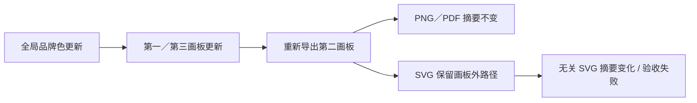

# VectorCraft 多画板 SVG 隔离缺口

固定插件 dev.8／技能源 dev.7／原生 CLI 0.2.0 的单导出技能冷启动出现真实失败。三个画板分别为 128×96、80×64、96×128，具有不同坐标原点；第一和第三画板绑定全局品牌色，第二画板是未绑定的绿色图标。

独立 Pillow／PyMuPDF 已核对两次交付的全部画幅、中心颜色、透明 PNG 边角、白底 PDF 边角及 PDF 无栅格图像；SVG viewBox 正确且无 image 元素。随后无关输出字节门禁失败：第二画板 SVG 带有画板外负坐标和超宽坐标的品牌路径，改色后改变其内容；PNG 和 PDF 字节相同。两次真实失败分别耗时 6.718、6.186 秒。[固定安装失败证据](evidence/installed-artboard-export-failure.json)。

CodeGraph 定位上游 `crates/engine/src/cmd/fileio/export.rs::export_source`：默认导出整个文档，selectedOnly 可筛选已选择对象。`select.rs::all_on_artboard` 按几何交集选择可选对象，可选对象会排除锁定内容。直接把全部 SVG 改为该选区导出会遗漏锁定对象，不能作为完整修复。

修复需要在保持锁定可见内容、描边／效果外扩、群组／裁切和空画板语义的前提下隔离 SVG 画板资产，或对已证明无变化的原生画板依赖复用旧输出。不能靠降低断言、仅比较渲染像素或删除任意路径宣称修复。当前尚未实施或发布修复；4.22 保持未完成，完整画板与品牌更新任务也保持开放。此前 PNG 色板更新证据仍按原范围有效。

真实驱动位于独立技能源 `tests/test_artboard_exports_first_use.py`，以已安装技能路径、空 runtime 和公开原生安装复现。默认离线测试显式跳过此用例，44 项中 28 项通过、16 项跳过不能掩盖上述真实失败。
