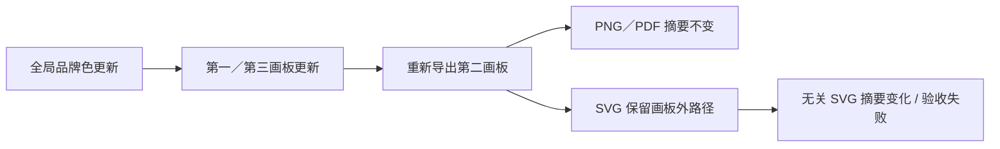
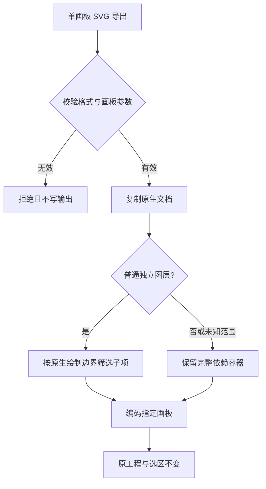

# VectorCraft 多画板 SVG 隔离缺口

固定插件 dev.8／技能源 dev.7／原生 CLI 0.2.0 的单导出技能冷启动出现真实失败。三个画板分别为 128×96、80×64、96×128，具有不同坐标原点；第一和第三画板绑定全局品牌色，第二画板是未绑定的绿色图标。

独立 Pillow／PyMuPDF 已核对两次交付的全部画幅、中心颜色、透明 PNG 边角、白底 PDF 边角及 PDF 无栅格图像；SVG viewBox 正确且无 image 元素。随后无关输出字节门禁失败：第二画板 SVG 带有画板外负坐标和超宽坐标的品牌路径，改色后改变其内容；PNG 和 PDF 字节相同。两次真实失败分别耗时 6.718、6.186 秒。[固定安装失败证据](evidence/installed-artboard-export-failure.json)。

CodeGraph 定位上游 `crates/engine/src/cmd/fileio/export.rs::export_source`：默认导出整个文档，selectedOnly 可筛选已选择对象。`select.rs::all_on_artboard` 按几何交集选择可选对象，可选对象会排除锁定内容。直接把全部 SVG 改为该选区导出会遗漏锁定对象，不能作为完整修复。

修复需要在保持锁定可见内容、描边／效果外扩、群组／裁切和空画板语义的前提下隔离 SVG 画板资产，或对已证明无变化的原生画板依赖复用旧输出。不能靠降低断言、仅比较渲染像素或删除任意路径宣称修复。原生候选修复已完成，但尚未发布修复版运行时或插件；4.22 保持未完成，完整画板与品牌更新任务也保持开放。此前 PNG 色板更新证据仍按原范围有效。

真实驱动位于独立技能源 `tests/test_artboard_exports_first_use.py`，以已安装技能路径、空 runtime 和公开原生安装复现。默认离线测试显式跳过此用例，44 项中 28 项通过、16 项跳过不能掩盖上述真实失败。

## 原生候选修复

维护版 CLI 候选 `0.2.0-craft.1` 基于上游 `90e022b0c05f12171a4e9bebe0894fa62f7bc95c`。新增的 `artboardContentOnly` 仅适用于单个 SVG／SVGZ 画板，复用原生渲染器的绘制边界，保留锁定可见对象和完整依赖容器。没有外观、裁切、蒙版、混合、文字绕排或未知子项范围的普通图层可以筛选子项；群组、裁切容器及未知绘制边界保守保留。跨画板群组保留完整依赖，不代表群组成员可以独立导出。无效索引和冲突的选区／范围参数直接拒绝，关闭此选项时保持原导出行为。

原生引擎完整库测试通过 954 项，包含 6 项隔离用例；12 项 CLI 集成测试也全部通过。单独复制导出技能后，在空 runtime 中通过显式本地候选 ZIP 安装 CLI，建立三个画板，导出九份 SVG／PNG／PDF，并在修改全局品牌色后再次导出。独立 Pillow／PyMuPDF 检查通过，无关画板三种格式保持字节一致；无效画板、重复输出拒绝与源目录／技能目录保全门禁也通过。该任务耗时 1.207 秒，只证明本地候选包安装，不证明公开发行下载。技能源测试通过 30 项、显式跳过 16 项。[候选证据](evidence/native-artboard-svg-candidate-20261006.json)。

独立技能源保存 `runtime/patches/artboard-svg-isolation.patch` 与 `runtime/artboard-svg-isolation-patch.json`；补丁从锁定上游源码准确复现全部 6 个修改文件。12 个技能安装器现已识别维护版后缀，并限定原生 VectorCraft 或本 VectorCraft 技能仓的 release 下载路径。当前运行时安装锁仍指向官方 0.2.0。完成运行时发布、SVG 工作流参数和不可变技能／插件锁更新、公开首次安装验收，以及 ArtCraft 对应 bundle 更新后，才能关闭 4.22。
