# VectorCraft Asset Handoff Architecture

## Authority and current stage

Behavior is owned by `VC-DM-007` in the existing OpenSpec change. Independent `vectorcraft-skills` owns implementation. This is a source candidate; plugin dev.10 remains its immutable older snapshot. No new fixed-release host acceptance is claimed.

## Problem and native boundaries

The public helper previously could create shapes but could not consume registered media. ArtCraft rejected every VectorCraft asset binding. The pinned maintained CLI `0.2.0-craft.2` already exposes file.place, links.relink, links.placementOptions and file.package; the new workflow uses those native commands.

Supported inputs are bounded PNG, JPEG and self-contained SVG, detected by content. SVG becomes editable embedded vector groups. Raster inputs default to linked image objects; explicit link=false embeds pixels. External SVG references, DTD/entities, scripts, foreignObject and external CSS URLs are rejected, rather than consumed without registration. Each input is at most 64 MiB. This does not claim every format that upstream file.place can read.

## Installation and execution

Each skill carries its own scripts, examples and references. Resolve SKILL_DIR from the actual host-loaded skill. No sibling installation or hard-coded mount is needed.

```mermaid
flowchart LR
    I[Registered input and digest] --> P[Preflight before installation]
    P --> B[Pinned native CLI bootstrap]
    B --> C[Copy and rehash input]
    C --> N[Native place or relink]
    N --> K[Native package: Links and Fonts]
    K --> O[Independent reopen and link check]
    O --> E[Export and hash delivery]
    E --> A[ArtCraft dependency verification]
```



```bash
python3 -I -B "$SKILL_DIR/scripts/workflow.py" \
  "$SKILL_DIR/examples/provided-assets.json" \
  --asset product=/absolute/product.png \
  --asset logo=/absolute/logo.svg \
  --output /absolute/brand-v1
```

## Operation contract

| Operation | Parameters | Native behavior |
| --- | --- | --- |
| asset.place | asset; optional at, rect, link | file.place with an internally resolved collected path |
| asset.replace | asset, replacement | links.relink for raster-to-raster; file.place replace for vector groups |

at and rect are mutually exclusive. Dimensions must be positive; coordinates finite. Arbitrary path, folder or base64 parameters are not accepted. The same alias may be placed multiple times; IDs are accumulated. A single alias cannot mix linked and embedded instances.

Raster replacement sets preserve=bounds and keeps image IDs. Embedded raster remains embedded. Each SVG group instance is separately replaced in its existing stacking position and bounds; new IDs are explicit and existing $ref bindings are updated. Consumers must use current bindings rather than stale hard-coded group IDs.

## Delivery and relocation

file.package collects linked files into Links and embeddable fonts into Fonts. Original embedded inputs are retained in Assets. Missing links fail publication. Unavailable or non-embeddable fonts are recorded as skippedFonts; a font record is not a promise that the font will work on another machine.

manifest.assets contains path, sha256, format, ids, linked and warnings. manifest.files recursively covers dependency files. Source revisions inherit and rehash registered dependencies before native editing. Export takes place from the collected project, after independent reopen and links.check.

Native links can retain an engine-generated original path as metadata; package-relative paths support relocation. Public JSON records redact input and staging paths. The original path is not new filesystem authority. Hashes are checked again before publication. Failure publishes no new successful delivery and preserves the old source directory; no automatic replay follows ambiguous native failures.

## ArtCraft integration

The public adapter accepts logical assetBindings, derives --asset arguments from verified artifacts and checks collected file hashes. For asset.replace it verifies the new input under the explicit original alias. Retained assets must match the verified source manifest. The adapter does not accept model-supplied host paths or manufacture source lineage for unused inputs.

## Validation and remaining gates

`tests/test_asset_first_use.py` copies only the asset skill, downloads the pinned CLI into an empty runtime, places linked PNG and embedded SVG twice, replaces them with JPEG/SVG, checks output pixels, preserves unrelated objects and old files, moves the delivery and directly reopens native links. ArtCraft's `test/vector_asset_workflow.test.ts` checks Vector-to-Photo input, source replacement and selective reuse.

The source-candidate evidence is separate from fixed plugin installation. New immutable skill/plugin snapshots, installed-host repetition, model dispatch, GUI, full creative acceptance, other native input formats and cross-machine font fidelity remain open. Existing SVG isolation and PDF date-binding regressions must remain green.
