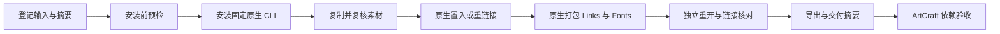

# VectorCraft 素材交接架构

## 事实源与当前阶段

行为由现有 OpenSpec 变更中的 `VC-DM-007` 持有，实现属于独立 `vectorcraft-skills`。当前为技能源候选；插件 dev.10 保留原不可变快照，尚未宣称新固定发行宿主验收。

## 问题与原生边界

原公开工作流可创建图形，却不能消费登记素材，ArtCraft 拒绝全部 VectorCraft 素材绑定。固定维护 CLI `0.2.0-craft.2` 已提供 file.place、links.relink、links.placementOptions 和 file.package，新工作流调用这些原生命令。

输入按内容识别有界 PNG、JPEG、自包含 SVG。SVG 置入为可编辑矢量组；栅格默认链接，link=false 嵌入像素。外部 SVG 引用、DTD／实体、脚本、foreignObject 和外部 CSS URL 拒绝，不隐式消费未登记文件。每项输入最大 64 MiB，不代表上游 file.place 全格式范围已验证。

## 安装与执行链

每项技能自带 scripts、examples 和 references，SKILL_DIR 使用宿主实际加载目录，不要求兄弟技能或固定挂载路径。



```bash
python3 -I -B "$SKILL_DIR/scripts/workflow.py" \
  "$SKILL_DIR/examples/provided-assets.json" \
  --asset product=/absolute/product.png \
  --asset logo=/absolute/logo.svg \
  --output /absolute/brand-v1
```

## 操作合同

| 操作 | 参数 | 原生映射 |
| --- | --- | --- |
| asset.place | asset；可选 at、rect、link | file.place，路径由已收集输入内部解析 |
| asset.replace | asset、replacement | 栅格重链接；涉及矢量组时 file.place replace |

at 与 rect 互斥，尺寸为正，坐标为有限值。计划不接受任意 path、folder 或 base64。同别名可放置多个实例，清单累积对象 ID；同别名不混用链接与嵌入实例。

栅格替换设置 preserve=bounds，保留图片 ID；嵌入栅格替换后仍嵌入。SVG 各组按原堆叠位置和边界分别置换，显式记录新 ID，更新已有 $ref 回执绑定。后续指令使用当前绑定，不能继续硬编码旧组 ID。

## 依赖交付与迁移

原生 file.package 收集链接到 Links、许可允许嵌入的字体到 Fonts；嵌入素材原文件保存在 Assets。缺失链接阻止发布。不可用或不允许嵌入的字体写入 skippedFonts，字体记录不证明换机器后可用。

manifest.assets 包含 path、sha256、format、ids、linked、warnings；manifest.files 递归覆盖依赖。源修订在原生编辑前继承并复核登记依赖。收集工程独立重开、links.check 通过后，再从该工程导出。

原生链接元数据可能保留引擎生成的原路径，包内相对引用用于迁移；公开 JSON 去除输入和暂存绝对路径。原路径不构成新读取授权。发布前再次核对摘要；失败不发布新成功交付，保留旧工程目录，结果不明确时不自动重放。

## ArtCraft 接入

公开适配器接收逻辑 assetBindings，从已核验产物派生 --asset，并验证实际收集文件摘要。asset.replace 根据显式原别名核对新输入；retained 必须匹配已验证的源清单。禁止模型提供本机路径，也不为未消费输入制造血缘。

## 验证与剩余门禁

`tests/test_asset_first_use.py` 只复制素材技能，空运行时公开下载安装，PNG 链接与 SVG 嵌入各两个实例，用 JPEG／SVG 替换，比较实际像素，无关对象和旧文件不变；移动交付后直接重开原生链接。ArtCraft 的 `test/vector_asset_workflow.test.ts` 验证 Vector 到 Photo 的真实输入、源修订与选择性复用。

候选证据与固定插件安装分开。新不可变技能／插件快照、安装宿主复验、模型派发、GUI、完整创作验收、其他原生素材格式和跨机器字体保真仍待完成。既有 SVG 隔离与 PDF 日期绑定必须继续通过回归。
