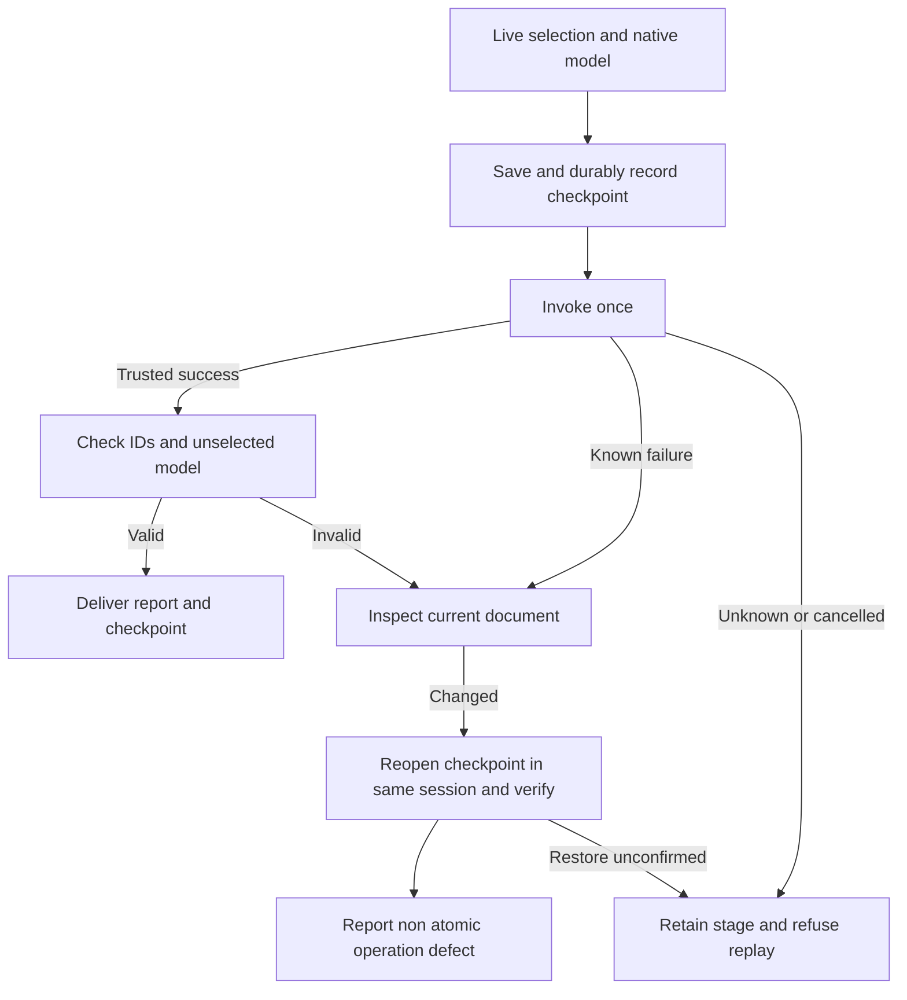

# Group and boolean transaction source candidate

The companion plugin owns OpenSpec `VC-DM-002`. This unpublished increment follows immutable source dev.36 and has not upgraded fixed plugin snapshots. It covers tests and minimal execution contracts; complete4.6 remains open.

Direct workflow commands, `native.command` and complete command plans share `boolean_transactions.py`. Group/ungroup and Pathfinder calls read live selection from document.inspect and the complete object tree from document.json. A retained checkpoint and durable submitted record precede one mutation. `boolean-transactions.json` binds command, participant/result IDs, checkpoint digest and state. Delivery manifests include checkpoints and the report. Checks compare unselected subtrees, ancestor properties, hierarchy order and document fields; grouping retains child contents and ungrouping checks released identities.

Known semantic or verification failure with a changed document reopens the checkpoint in the same valid session, verifies the complete model, restores selection and raises `non_atomic_operation_defect`. An unchanged document retains its original failure. Timeouts, disconnection, cancellation, epoch/source conflicts never trigger automatic recovery or replay; unconfirmed restoration stays unknown. Existing failure preservation retains the original stage.

When asset collection changes the delivery root, an independent session packages each checkpoint. Full models are compared, replacing only link paths and copied mtimes with actual content SHA values. Checked links and the packaged checkpoint identity enter the report, allowing moved deliveries to reopen prior objects and dependencies.

[Candidate evidence](evidence/boolean-transactions-candidate-20261008.json) covers14 real native cases: direct/gateway four boolean operations and grouping, complete group/ungroup, linked-asset checkpoint relocation and explicit known/unknown post-success fault injection. Injected failures do not establish an existing native engine defect. All Pathfinder contexts, curve topology correctness, GUI concurrency, creative judgments and fixed-release installation remain open. Historical optimization reports retain original execution fingerprints; CI verifies this new candidate without rebinding old evidence.
