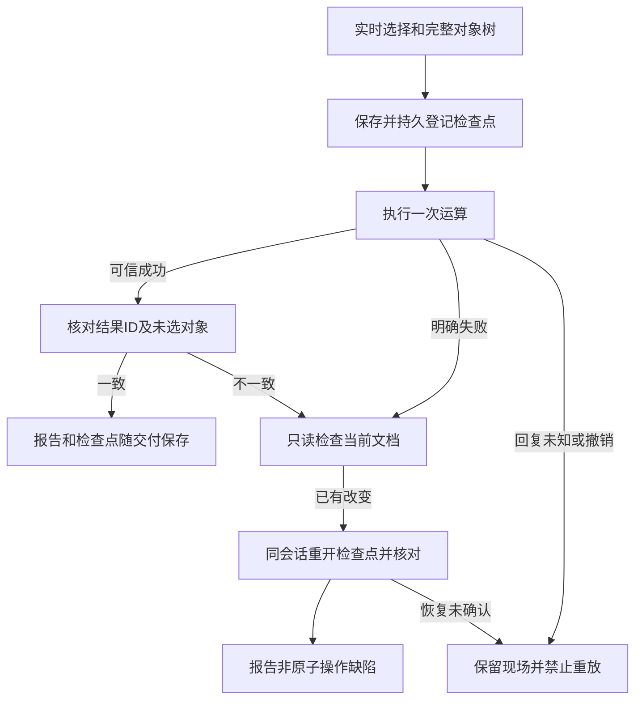

# 分组与布尔事务源码候选

OpenSpec `VC-DM-002` 由伴生插件持有。本增量基于不可变技能源dev.36，尚未发布或升级固定插件；只实现测试与最小执行合同，不宣称完整4.6验收。

普通工作流直接命令、`native.command` 反射入口及完整命令计划共用 `boolean_transactions.py`。支持识别分组／解组及Pathfinder命令；每步从原生document.inspect读取实时选择，从document.json读取完整对象树，保存原位置检查点后才执行一次。`boolean-transactions.json`记录命令、参与ID、结果ID、检查点摘要与状态，成功交付清单包含报告和检查点。验证比较未选子树、祖先属性、层级顺序及文档属性；分组保留子对象内容，解组核对释放对象身份。

明确语义失败或结果核验失败且文档已经改变时，在仍有效的同一会话恢复检查点，验证完整文档并恢复选择，随后报 `non_atomic_operation_defect`。无改变则保留原失败；超时、断连、撤销、epoch或源版本失配不自动恢复／重放；恢复未确认保持unknown。失败目录由既有机制留在原路径。

素材收集切换交付根时，独立会话从检查点执行原生package，完整比较收集前后的模型；仅链接路径、相对路径与复制后的mtime以实际内容SHA替代。验证链接后将新检查点路径和摘要纳入交付报告。这样移动交付副本仍能重开修改前对象与依赖。

[候选证据](evidence/boolean-transactions-candidate-20261008.json)包含真实原生直接／反射四类布尔与分组、完整命令分组解组、链接素材检查点迁移、成功操作后的明确语义失败／丢失回复注入，共14例。故障是测试注入，不代表发现原生引擎自身已存在同样缺陷。全部Pathfinder上下文、曲线拓扑正确性、GUI并发、创作判断及固定发行安装验收继续开放。历史优化报告保留原执行摘要，当前CI改核验本候选证据，不重绑定旧证据。

## 技能源37的受控结构授权

新增显式structure授权。实际选择必须匹配已授权ID，结构修改要求参与子树的全部对象ID均已授权，再次核对结果身份和未选模型。kind字段授权不推断为结构授权。8项真实Harness案例覆盖直接／反射分组、解组、合并及修改前拒绝。完整4.6、GUI和创作验收仍独立开放。源回归174项，144通过、30环境跳过。之前的候选证据按原摘要保存在boolean-transactions-before-managed-20261008.json。
