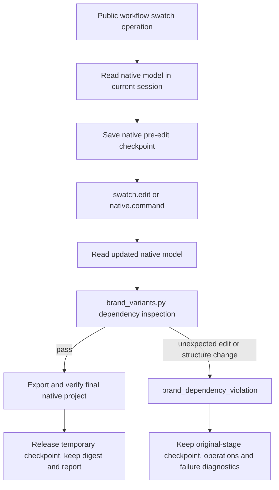

# VectorCraft Brand Dependency Execution Guard Architecture

## Objective and status

Implements the VC-DM-006-GUARD OpenSpec scenario as a source candidate across13 independent skills. Tests previously detected unintended edits, but the old public workflow did not enforce dependency acceptance. Fixed plugin dev.35/source dev.31 and Art bundled bytes remain unchanged. Task4.28 tracks fixed release and installed-copy qualification; candidate code is not an installed-feature claim.

## Components and flow

Explicit native swatch references define consumers; equal RGB values do not. Object properties are compared separately from descendant properties while retaining ordered child IDs. Reject changes to unbound properties, object membership, container ordering or artboards. Nested text-style swatch references are supported.

## Delivery and failure semantics

`brand-dependencies.json` records consumer IDs, affected IDs, unexpected dependency edges, model digests and checkpoint identity. Successful manifests bind it through `brandDependencyReport`. Successful delivery contains the final native project; the temporary checkpoint is released and `checkpointRetained` isfalse. Its historical name is not a delivered-file link.

On dependency failure, the checkpoint remains in its original stage with `checkpointRetained:true`. `failure.json` binds retained-file digests and operations and forbids replay. Keeping its original location preserves absolute asset links. It represents the intermediate state before that swatch operation and never overwrites the user source project. Unintended updates cannot publish a successful delivery.

## Evidence

See `evidence/vectorcraft-brand-dependency-guard-candidate-20261008.json`. Reconstruct the behavioral red from baseline commit6212e42 with the current driver: a QA-only proxy completes the real swatch command and then executes one extra native paint.setFill to simulate an erroneous same-color non-consumer update. The baseline improperly publishes success. This controlled fault does not claim that the upstream healthy swatch implementation normally has that bug.

Two native cases pass: shapes/text, and a linked-image project. Each exercises direct and native-command gateway refusal, one injection without replay, independent native checkpoint reopening, retained digests and original-project preservation. Healthy revisions and unchanged same-color control pixels also pass. Linked inputs remain readable with no missing/modified links; legitimate stage relocation changes image paths/timestamps and is not falsely rejected by comparison to source absolute paths.

Source regression:143 total,114 passed,29 conditional skips, including7 guard units. Two explicit native cases pass in0.517/0.531 seconds using an existing verified runtime. All64 old fixed installed identities remain unchanged; they do not include this new guard.

## Remaining gates

Task4.27 closes only the source candidate;4.28 remains open for immutable distribution and installed acceptance. Full VC-DM-006 still includes asset replacement and other dependencies. Standalone commands.py, all color models, external-editor fidelity, pixel quality, GUI and generic Skills CLI installation remain separate. Art domain-bundle upgrades require their own qualification.
