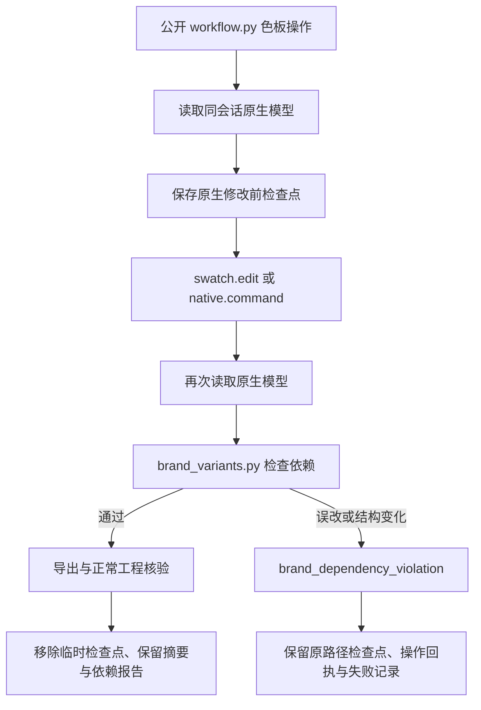

# VectorCraft 品牌依赖执行守卫架构

## 目标与状态

对应 OpenSpec VC-DM-006-GUARD。已有测试能发现误改，但旧公开工作流未执行依赖验收。当前实现为源码候选，已同步13项独立技能；插件固定快照仍为 dev.35／技能源 dev.31，Art内置版本也没有改变。固定发行及实际安装验收由任务4.28追踪，不将源码候选当成已安装功能。

## 组件与执行流程

`brand_variants.py` 按原生显式 swatch 引用寻找消费者，不以RGB相同判断消费关系。对象自身属性与容器子对象分开比较，容器仍保留子对象稳定ID顺序。未绑定对象属性变化、对象增删、容器成员或顺序变化及画板变化均拒绝成功交付。文字样式中的嵌套 swatch 引用同样识别。

## 交付与失败语义

`brand-dependencies.json` 保存消费者ID、受影响对象ID、错误依赖边、前后模型摘要及修改前检查点摘要。成功 manifest 通过 `brandDependencyReport` 绑定该报告。成功只交付最终原生工程；检查点的 `checkpointRetained` 为false，名称是历史身份，不能当作成功交付文件链接。

失败时检查点的 `checkpointRetained` 为true。失败目录的 `failure.json` 指向原暂存路径，登记所有保留文件摘要和回执，禁止自动重放。检查点不移动，以保持绝对素材链接有效。它是本次色板修改前的中间状态；不会覆盖用户源工程。只有通过全部检查后才清理临时检查点，不能把失败的无关对象修改发布为成功。

## 验证证据

证据见 `evidence/vectorcraft-brand-dependency-guard-candidate-20261008.json`。历史基线来自提交6212e42，使用当前测试驱动重建行为红灯：QA代理先让真实原生色板操作完成，再额外执行一次真实 paint.setFill，模拟引擎误改同色非消费者。旧入口发布了错误成功清单；这是受控故障注入，不是声称上游正常色板操作存在此缺陷。

当前候选两项原生用例通过：纯图形／文字，以及包含链接图片的工程。每项均测试普通操作和native.command网关的误改拒绝、仅一次注入、不自动重放、检查点独立原生重开、故障文件摘要与源工程保全；正常色板返工和同色控制像素也通过。链接工程核验链接无缺失、无修改；图片路径及文件时间戳因合法暂存重定位可变化，不用源目录的绝对路径作为逐对象相等断言。

源码回归143总／114通过／29条件跳过，新增守卫单元7项。两项原生候选分别0.517秒／0.531秒，复用已有已校验运行时。旧固定安装矩阵64项身份保持，不证明它已经包含此守卫。

## 剩余工作

任务4.27关闭源码候选门禁；4.28固定发行和安装后验收开放。完整VC-DM-006仍包括素材替换与其他依赖场景。独立commands.py原生命令入口、其他颜色模型、外部编辑器、像素质量、GUI和通用Skills CLI不由此验收关闭。Art领域包升级另行验证。
