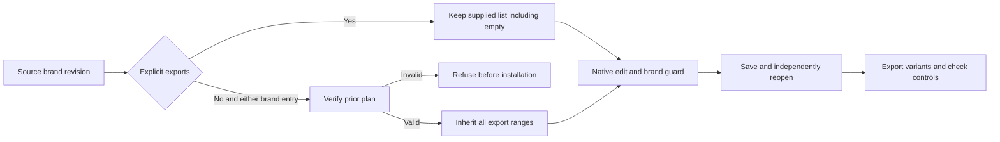

# VectorCraft brand gateway variant delivery

Direct swatch.edit and native.command/swatch.edit must share source-revision export semantics. An omitted exports field inherits the verified prior list; an explicit empty list requests native-only delivery.

## Defect and change

The fixed plugin36/source32 export-skill copy really edited the global brand color but omitted all9 SVG/PNG/PDF variants across three artboards. Its gateway branch also skipped prior-plan integrity checks. A saved native project therefore did not establish complete variant delivery. Pre-install failures and actual missing output files reproduced the defect.

The minimal change recognizes both brand-edit forms in the existing inheritance branch. Native project and manifest digests remain checked first. Before asset preflight, installation and native edits, both forms validate the prior plan file, symlink boundary and digest, then use existing export-list validation. There is no new CLI, account interface or plan field; native and brand dependency guards retain their contracts.

## Native evidence

A single export skill cold-installs the public native CLI. Both entry forms deliver9 variants: associated PNG colors change, unrelated SVG/PNG/PDF bytes remain identical, and original deliveries and skill bytes stay intact. Both explicit-empty cases pass; separate tampered source plans fail before creating new runtimes or deliveries. Native CLI0.2.0-craft.2 discovers585 commands. Source regression147:117 passed,30 conditional skips; all3 pre-install tests and the native acceptance driver pass. [Candidate evidence](evidence/vectorcraft-gateway-export-candidate-20261008.json).

Task4.30 separately requires immutable publication, actual installed acceptance and13 independent first-use cases. Art's bundled source needs a separate upgrade. Full VC-DM-006, exhaustive command contexts and V1 remain open.

Fixed acceptance: task4.30 passes for plugin37/source33. Each of13 actual installed skills independently completes native cold first use and nine-variant revisions through both entries. All64 installation identities match;51 historical cold cases were not rerun. Art116 bundle upgrade is still unexecuted; full VC-DM-006 remains open. [Evidence](evidence/craft-vector37-gateway-export-fixed-first-use-20261008.json).
