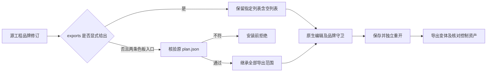

# VectorCraft 品牌网关变体交付

普通 swatch.edit 与 native.command/swatch.edit 在源修订中应有相同导出语义：省略 exports 时沿用摘要核验后的原清单，显式空列表则只交付原生工程。

## 已确认缺陷与修改

固定 plugin36/source32 的真实单技能副本，在全局品牌色返工后遗漏三画板全部九份 SVG／PNG／PDF，且网关分支未核验被篡改的原计划。编辑本身已完成，因而原生工程存在不能证明变体交付完整。两项安装前失败断言与真实原生缺失文件记录构成红灯。

最小修改仅统一源修订的色板操作识别。旧 project.vectorcraft 与 manifest 摘要先核验；两条入口在素材预检、安装与原生操作前共同校验 plan.json 的文件、符号链接与摘要，再调用已有导出清单验证。没有新 CLI、登录接口或计划字段；原生和品牌依赖守卫保持现有合同。

## 原生验收

候选公开冷安装单个导出技能后，两入口各交付九份变体；两个品牌画板 PNG 呈现新颜色，独立画板 SVG／PNG／PDF 字节不变，原交付和技能保全。两入口显式空列表均有效；两份独立的篡改源计划均在新运行时及新交付创建前拒绝。原生 CLI 0.2.0-craft.2、585 命令实际发现；源码147项117通过30条件跳过，安装前目标3项通过，原生完整驱动1项通过。[候选证据](evidence/vectorcraft-gateway-export-candidate-20261008.json)。

固定发行／实际安装副本及十三技能独立首用由4.30管理；Art捆绑包需要单独升级。完整VC-DM-006、逐命令上下文与V1仍开放。
