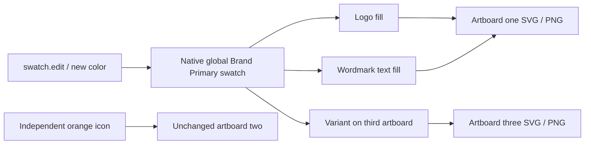
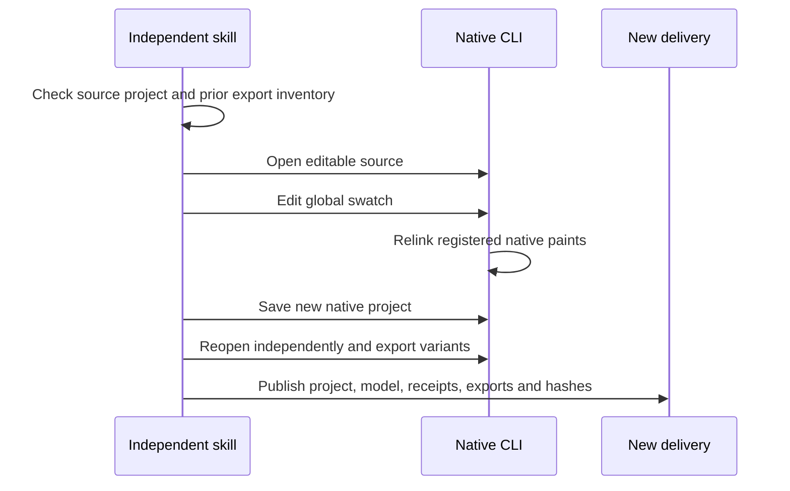

# VectorCraft native brand token architecture

## 1. Authority and implementation state

OpenSpec VC-DM-006 governs related variant updates and unchanged unrelated objects. This source working-tree implementation adds the existing native swatch.new/edit/list commands to the workflow allowlist. Native CLI remains 0.2.0. It is not yet present in the published plugin/skill snapshot. The generic example's default orange palette is unchanged; dual-palette coverage is a separate controlled test.

## 2. Native dependency flow

A global swatch is the native token. Explicit paint.setFill IDs register the related path/text consumers; the engine retains those links inside the editable .vectorcraft project. The returned swatch name is stored under an operation alias, so later edits resolve the actual name rather than guessing names after a collision. No additional registry or new native command is introduced.

## 3. Revision and outputs

Source revision must match the separately saved project SHA. The helper opens the original project, changes its global swatch and saves a new project before independent native reopening and export. Original files stay unchanged. Explicit exports remain supported. When a swatch.edit revision omits exports, the helper verifies the prior plan.json against its manifest digest and inherits its export inventory. Tampered inventories fail before runtime work.

Exports flatten colors according to their format; preserving editable global swatches after interchange is not claimed. The native project remains the authoritative editable delivery.

## 4. First use and failure behavior

Every one of the twelve independent skills carries the helper, example and guide. The appearance skill activates for brand colors. Scripts resolve from its loaded SKILL.md directory and bootstrap the pinned CLI on first use. Missing runtime capabilities, unknown swatches, stale source hashes, tampered source plans and existing output directories stop the operation. Failed native execution does not publish a successful delivery; unknown session results are not automatically retried by the session wrapper.

## 5. Evidence and limits

The initial native test failed because swatch.new was outside the workflow allowlist. After the policy extension, a single copied appearance skill using a fresh default-public runtime cache passes in 6.892 seconds. It creates three native artboards and a global RGB swatch, changes one token, checks revised SVG colors and decoded PNG pixels in two linked artboards, and verifies the unrelated icon PNG and original project bytes. It also checks unknown-swatches and source-plan tampering cannot publish output, and no skill bytecode cache appears. See docs/evidence/native-brand-token-first-use.json.

This proves registered RGB global swatch propagation in the native project. Other color models, tint/gradient/spot propagation, cross-editor token fidelity, cross-file consumers, model dispatch, GUI and human creative acceptance are separate unverified scopes. Publication and fixed-release installed-host evidence remain pending.
