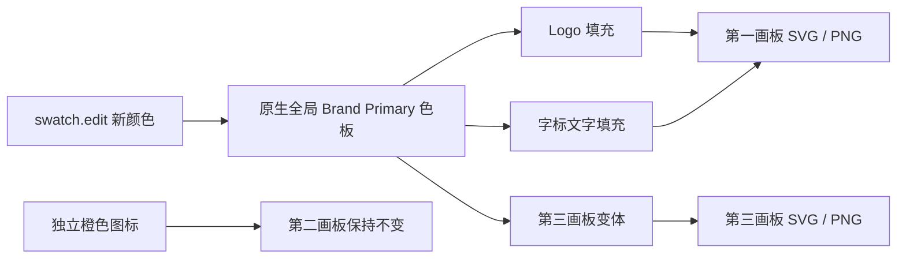
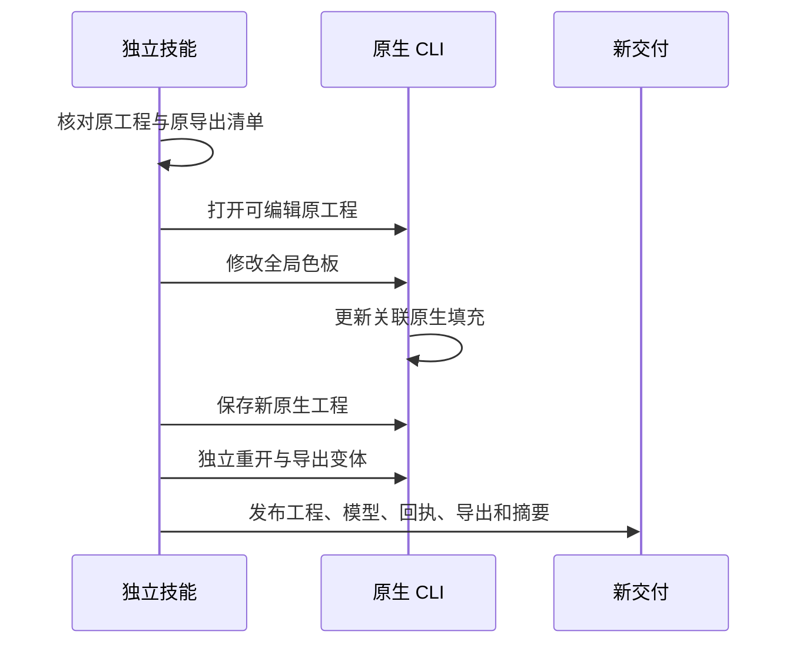

# VectorCraft 原生品牌 token 架构

## 1. 规范与实施状态

沿用 OpenSpec VC-DM-006 的关联变体更新与无关对象保留要求。本次技能源工作树开放原生 swatch.new/edit/list 工作流命令，原生 CLI 保持 0.2.0；尚未进入已发布插件／技能源快照。通用示例默认橙色不变，双配色验证属于独立受控测试。

## 2. 原生依赖流

全局色板即原生 token。paint.setFill 的明确对象 ID 登记路径与文字消费者，关联关系保存在可编辑 .vectorcraft 内。操作别名保存色板真实返回名称，避免重名后猜测名称。不引入额外注册表，也不新增同名原生 CLI 命令。

## 3. 修订与输出

源工程必须匹配此前单独保存的摘要。工作流打开原工程、修改全局色板、另存新工程，独立会话重开后导出。原文件字节不变。支持明确导出列表；swatch.edit 修订省略 exports 时，先核对源 plan.json 与 manifest 记录摘要，再继承其变体导出列表。清单篡改在运行时工作前失败。

交换导出按格式保存最终颜色；不宣称外部编辑器可保留原生色板关联。原生工程继续作为可编辑交付事实源。

## 4. 首次使用与失败语义

十二个独立技能均携带脚本、示例与指南，配色技能按品牌颜色需求激活。以实际加载 SKILL.md 目录定位入口，首次安装固定 CLI。缺少能力、未知色板、旧工程摘要、源计划篡改或既有输出目录均停止。原生失败不发布成功交付，会话结果未知不自动重试。

## 5. 证据与边界

初始真实测试因工作流白名单缺少 swatch.new 而失败。开放后，单独复制的配色技能使用全新默认在线运行时缓存，在 6.892 秒内通过：创建三个原生画板与 RGB 全局色板，修改一个 token，检查两个关联画板的新 SVG 色值与 PNG 像素，无关图标 PNG 和原工程保持字节一致。未知色板与源计划篡改不发布输出，技能目录无字节码缓存。证据见 docs/evidence/native-brand-token-first-use.json。

当前证明原生工程内已关联的 RGB 全局色板传播。其他颜色模型、tint／gradient／spot、跨编辑器 token 保真、跨文件消费者、模型派发、GUI 和人工创作接受尚未验证。发布及固定发行版安装后验收仍待执行。
