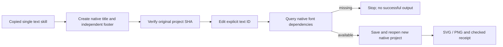

# VectorCraft Chinese text revision architecture

## 1. Authority and versions

OpenSpec VC-DM-003-TEXT and task 4.20 cover explicit native text revision and font dependencies. Published skill source dev.7 exposes the existing text.setText command; native CLI remains 0.2.0. This is not a new native text engine.

## 2. Independent flow

Each of twelve independent skills carries the helper, Chinese example and local guide. The text skill routes typography tasks. The example uses Songti SC, confirmed available by the tested native database on macOS arm64. Text remains editable inside .vectorcraft; SVG records Unicode and font family but does not embed the system font.

## 3. Guardrails and native semantics

The workflow requires exactly one explicit id/ids target and string text; malformed scopes and extra style parameters are rejected before native work. The native engine rejects IDs without text objects. text.setText replaces full contents while keeping the first run's style; multiple style runs collapse to that style and are not claimed lossless. The original project stays byte-identical. Before saving, text.fonts is queried; any missing family/style prevents successful delivery. Available dependencies are recorded in fontDependencies. This tightens prior silent fallback behavior; callers must select an available font or arrange an approved replacement.

## 4. Evidence

The initial native test fails on the missing workflow command. A second negative test confirms missing-font fallback previously still published output. The corrected single copied text skill passes a fresh public cold install in 7.001 seconds: changed same-length Chinese glyphs, native Unicode and first-style preservation, unchanged independent footer and original project, SVG font declaration, unknown-ID and missing-font refusal. Default regression is 42 tests: 28 pass and 14 gated skips, 9.632 seconds. Actual preview glyphs were visually inspected by the agent; this is not human creative acceptance.

Plugin dev.8 is published. Five fixed releases and 58 skills are discovered without loading errors; the actual installed text skill passes its separate cold native test in 8.275 seconds. All 58 installed hashes remain unchanged. Supplementary PhotoCraft/EffectCraft source-helper cold renders and revisions preserve Unicode/font in native deliveries; these are not copied-skill or host acceptance evidence. See docs/evidence/native-chinese-text.json.

## 5. Boundaries

No new font is downloaded. Other fonts, full CJK shaping, rich text range editing, cross-machine fidelity, model dispatch, GUI and human creative acceptance remain separate scopes. Font presence and visible Unicode are both checked; neither alone establishes all typography behavior.

Default brand examples now use bundled Source Sans 3 so the native font check also passes their cold brand-swatch regression (1 test, 6.209 seconds). User project fonts are not replaced. The native missing flag describes its loaded font database, not the OS inventory; no complete system-font coverage is claimed.
