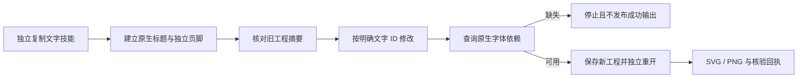

# VectorCraft 中文文字修订架构

## 1. 规范与版本

沿用 OpenSpec VC-DM-003-TEXT 与任务 4.20。候选技能源 dev.7 开放已有原生 text.setText，原生 CLI 保持 0.2.0，不新增文字引擎。

## 2. 独立执行流

十二个独立技能均自带脚本、中文示例和本地指南，文字技能路由排版任务。示例使用当前 macOS arm64 原生字体库确认可用的 Songti SC；.vectorcraft 保持文字可编辑，SVG 记录 Unicode 与字体名称，不内嵌系统字体。

## 3. 范围与原生语义

工作流必须明确指定唯一 id／ids 参数及字符串文字；非法目标与额外样式参数在原生调用前拒绝。不存在的文字对象由原生引擎拒绝。text.setText 整段替换并保留首段样式，多样式段落会合并为该样式，不能宣称无损。旧工程字节不变。保存前查询 text.fonts，存在缺失字体／样式时停止成功交付，可用依赖记录到 fontDependencies。此前隐式字体回退不再静默作为成功交付，调用者需选择可用字体或安排已批准替代。

## 4. 证据

初始真实测试因工作流没有开放命令而失败；第二个负向测试确认缺失字体此前仍可发布回退结果。修复后，单独文字技能在线全新缓存测试在 7.001 秒通过：同长度中文呈现不同字形，原生 Unicode 和首样式保留，独立页脚与旧工程不变，SVG 字体声明正确，未知对象与缺失字体拒绝。默认回归 42 项，28 项通过、14 项门禁跳过，耗时 9.632 秒。智能体查看了实际字形预览，此观察不是人工创作接受。

发布与固定发行版安装后验收待完成。PhotoCraft／EffectCraft 补充源脚本冷启动导出与修订保留了原生 Unicode／字体，这不是单技能复制或宿主验收。证据见 docs/evidence/native-chinese-text.json。

## 5. 边界

不下载新字体。其他字体、完整 CJK 排版、富文本范围编辑、跨机器保真、模型派发、GUI 与人工创作接受需单独证据。字体存在与实际 Unicode 字形都须核对，二者不能单独证明全部文字排版能力。

品牌示例改用 CLI 自带 Source Sans 3，原生冷启动品牌色回归也通过（1 项，6.209 秒）。用户工程字体不自动替换。原生 missing 标志对应其已加载字体库，不等同于操作系统字体安装清单，不宣称完整系统字体覆盖。
