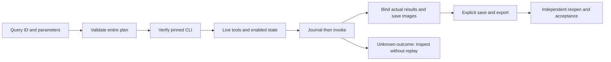

# VectorCraft complete command architecture

Updated 2026-10-07. Documentation and the native entry are implemented; full per-command and GUI acceptance remain open.

## 1. Decision and boundaries

The bounded delivery workflow has 27 operations: 25 reflected commands plus two asset-contract operations. The native registry contains 585 commands. A new independent `commands.py` entry covers the complete registry while retaining the existing delivery contract. Native command results require separate checks before becoming craft-artifact/v1 deliverables.

## 2. Ownership and components

The independent skill package owns `scripts/build_command_coverage.py`, the canonical `vectorcraft-use` resources, and all synchronized standalone skills. Each skill carries its own scripts, full reference, live native snapshot, and runnable example. The plugin vendors an immutable tagged source with `skills.lock.json` and the vendor tool. Unmatched command prefixes route to `vectorcraft-cli`; scenario skill owners remain available by name and installation command.

`command-coverage.json` retains every original parameter string, owner, workflow mapping and NOT_RUN status for this audit's full per-command acceptance. `native-command-snapshot.json` retains actual MCP input schemas and the empty-session observation. Parameter strings are not invented JSON schemas. `command-reference.md` and `command-usage.md` provide the complete usage content.

## 3. Execution lifecycle



`$ref` uses actual earlier return values and retains integer precision. Forward references, duplicate names, unknown IDs, nonfinite numbers and invalid output paths fail before installation or output creation. Wrapped command-executor tools cannot bypass registry preflight. Native scripting/batch tools retain their own native semantics; callers remain responsible for embedded programs.

Each command queries its current enabled state. Disabled commands stop with their native reason. GUI operations require explicit bridge mode and a loopback connection; no silent fallback creates another project. PhotoCraft reads its control token from a file, never from a persisted plan.

MCP isError and embedded error fields stop execution. Image replies are saved as attachments with digest/size metadata, not base64 logs. Uninterpretable command replies, timeout and disconnection record unknown. Mutations are never automatically retried.

## 4. Files and recovery

`--input NAME=FILE` copies and hashes regular files. Use `$ref: NAME.path` for domain-correct paths. `$output` is relative to a new output directory and cannot overwrite receipts or traverse parents. PhotoCraft uses paths within its automation root; other engines receive native absolute paths. Literal parameter paths still follow engine permissions; this entry is not a universal arbitrary-script filesystem sandbox.

`journal.json` records each started/completed step. `success.json` establishes interpretable command responses; `failure.json` distinguishes blocked, failed and unknown states. Explicit native save/export commands create outputs. Reopening, dependencies, visual fidelity and local revisions require separate acceptance. Preserve an unknown run, inspect its project and journal, then create a new recovery plan/output.

## 5. Quick start and validation

Install one skill: `npx skills add full-aigc-skills/vectorcraft-skills --skill vectorcraft-cli`. Set SKILL_DIR to the directory containing the SKILL.md actually loaded by the host, including user/project .agents/skills or plugin layouts.

```bash
python3 -I -B "$SKILL_DIR/scripts/commands.py" list
python3 -I -B "$SKILL_DIR/scripts/commands.py" describe file.new
python3 -I -B "$SKILL_DIR/scripts/commands.py" check "$SKILL_DIR/examples/commands-advanced.json"
python3 -I -B "$SKILL_DIR/scripts/commands.py" run "$SKILL_DIR/examples/commands-advanced.json" --output NEW_OUTPUT_DIRECTORY
```

In the independent source repository, run generator/suite `--check`, `test_commands.py`, and opt-in `CRAFT_NATIVE_COMMANDS=1` native tests. Native samples require the pinned macOS arm64 CLI and Pillow. They check an isolated single-skill copy, actual return references, save/reopen, persisted domain settings, rendered 96×64 images and unchanged source hashes. They reuse an installed runtime, rather than establishing cold online installation or full GUI acceptance. [Evidence](evidence/complete-commands-20261007.json).

## 6. Specification and remaining work

The plugin's existing OpenSpec `establish-v1-plugin` CM-001 requirement is authoritative. Tasks 8.1 and 8.2 cover regression, full documentation, invocation and vendor synchronization. Task 8.3 remains open for every command's applicable context, GUI/output assertions, local revisions, fixed publication and installed-copy verification. The complete registry retains NOT_RUN for that comprehensive audit; older bounded scene evidence remains separate.

## 7. Public cold first use

All 12 independently copied skills passed separate empty-runtime public downloads, native create/save/reopen/render and preserved hashes. [Evidence](evidence/complete-commands-cold-first-use-20261007.json). This supplements the earlier reuse sample; full command and host acceptance remain open. Reproduce with CRAFT_NATIVE_COMMANDS=1 CRAFT_NATIVE_COLD=1 and optional CRAFT_NATIVE_SKILL=<name> in the independent native test.

## Targeted revision recipes

The complete-command entry now includes paired executable creation/revision recipes, explicit selection prerequisites after reopening, and native persisted-state/non-target checks. Each standalone skill includes both JSON plans. [Usage](../skills/vectorcraft-use/references/command-usage.md#7-可执行局部返工--executable-targeted-revision). Full per-command and GUI acceptance remains open.

The opt-in native test executes the documented creation and revision plans from one copied skill and a fresh public runtime. Film speed changes preserve the first clip/transition/audio; Effect expression changes preserve composition/layer settings; Photo opacity changes preserve the other layers/effects/channels; Vector fill changes preserve other shapes/symbols/artboards. Original deliveries and source/copied skill fingerprints must remain identical.
