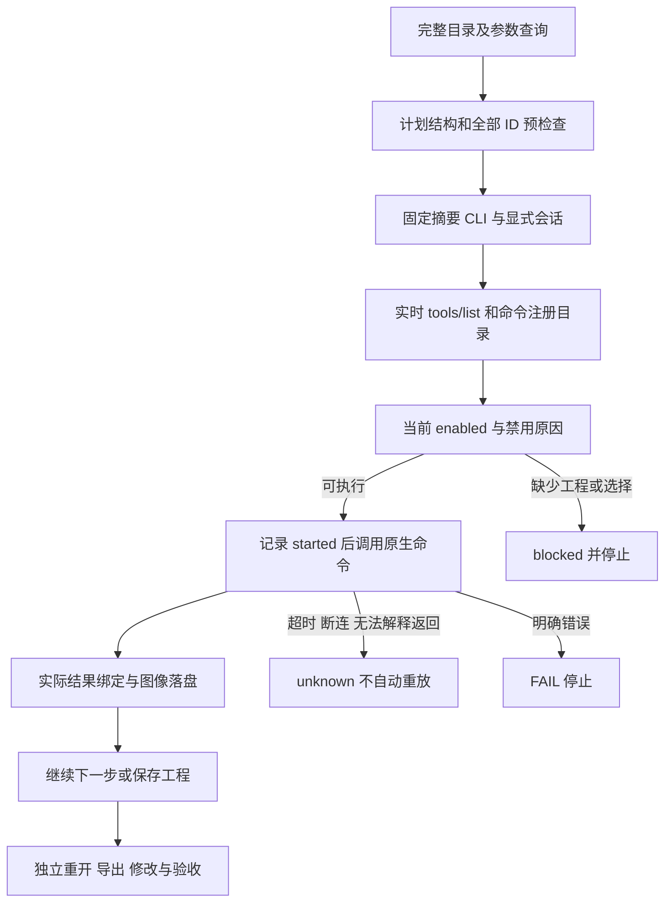
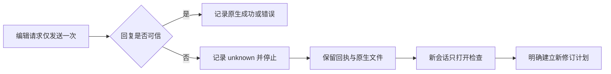

# VectorCraft 完整命令调用架构

> 日期：2026-10-07。状态：目录与调用入口已实现；完整逐命令与 GUI 验收未完成。

## 1. 问题与决定

原交付工作流共有 27 个受约束操作，其中 25 个是反射命令，另两个是素材合同操作。反射目录共 585 个原生命令。直接把所有命令加入交付工作流会缺少对应素材、回执、导出与验收语义。

本次保留已有交付合同，增加独立、全覆盖的原生命令入口 `commands.py`。它运行所有收录的命令，使用当前原生工程和选择状态检查前置条件；复杂任务仍由现有场景技能组织。原生操作结果不自动冒充 craft-artifact/v1 交付物。

## 2. 组件与所有权

| 组件 | 文件 | 职责 |
| :--- | :--- | :--- |
| 固定反射 | `skills/vectorcraft-use/references/commands.json` | 原始命令 ID 与参数说明 |
| 原生观察 | `references/native-command-snapshot.json`（各技能内） | 固定 CLI 的 MCP 工具 Schema、注册命令、空会话状态 |
| 目录生成 | 独立技能源 `scripts/build_command_coverage.py` | 每项保留参数原文、技能归属、工作流覆盖和验收状态 |
| 操作指南 | 各技能 `references/command-usage.md` | 环境、计划、输入、GUI、恢复和验收 |
| 完整参考 | 各技能 `references/command-reference.md` | 585 个命令逐项说明 |
| 原生执行器 | 各技能 `scripts/commands.py` | list / describe / check / run；同会话对象引用 |
| 运行时 | 各技能 `scripts/bootstrap.py`、`runtime.lock.json` | 固定摘要安装与复用 |
| 插件快照 | `skills.lock.json`、`scripts/vendor/skill_vendor.py`（插件内） | 从独立技能源固定标签同步；禁止直接改 vendored skills |

全部场景技能各自携带资源，单独安装不依赖兄弟技能。未匹配场景前缀的命令归公共 CLI 技能；以后可按真实任务增加细分技能，而不是把命令数当技能数。

## 3. 调用与失败状态



同一会话中 `$ref` 引用真实返回值，保留整数 ID 精度与列表类型。禁止前向引用、重复别名、非有限数、未知命令；必须先检查整个计划，再安装和创建输出。不能用原生执行工具包装绕过逐命令预检查。显式脚本、批处理等原生工具仍按自身原生协议工作，调用者负责内部程序的语义。

命令每次执行前重新查询实时 enabled。截图、菜单、输入等 GUI 操作通过明确的 `--mode bridge --connect 127.0.0.1:PORT`；无连接不自动回退为新工程。PhotoCraft 的控制令牌通过文件参数传入，不放计划或回执。

文字 JSON 结果检查 MCP isError 和嵌入 error；图片返回保存为附件，只在回执记录路径、大小与 SHA256。未解释的执行返回保留 unknown；超时和断连不自动重放修改。

## 4. 输入、输出和恢复

通过 `--input NAME=FILE` 复制普通输入文件并核对复制前后摘要，计划用 `$ref: NAME.path`。`$output` 必须是新输出目录内的相对文件名，禁止目录穿越及覆盖回执。PhotoCraft 向受限原生根目录传相对路径，其他工具按其原生协议传绝对路径。原始参数字符串仍受原生权限合同约束；此入口不是任意脚本的通用文件沙箱。

输出包括 `journal.json`、`success.json` 或 `failure.json` 及计划明确要求的工程/渲染文件。PASS 表示步骤获得可解释的成功回执。工程重开、素材完整性、最终画面和交换损失分别验收。unknown 后先检查工程及日志，确认哪些修改已生效，再生成明确的新计划；不复用旧输出目录覆盖证据。

## 5. 使用及验证

安装单技能：`npx skills add full-aigc-skills/vectorcraft-skills --skill vectorcraft-cli`。`SKILL_DIR` 设置为宿主本次实际加载的 SKILL.md 所在绝对目录，适用于 `.agents/skills` 或插件内目录。

```bash
python3 -I -B "$SKILL_DIR/scripts/commands.py" list
python3 -I -B "$SKILL_DIR/scripts/commands.py" describe file.new
python3 -I -B "$SKILL_DIR/scripts/commands.py" check "$SKILL_DIR/examples/commands-advanced.json"
python3 -I -B "$SKILL_DIR/scripts/commands.py" run "$SKILL_DIR/examples/commands-advanced.json" --output NEW_OUTPUT_DIRECTORY
```

四个领域具体 ID 不完全相同，其他命令应从 list 选择。可直接运行本技能自带的 `commands-advanced.json`，无需猜测对象 ID。

独立技能源验证命令：

```bash
python3 -B scripts/build_command_coverage.py --check
python3 -B scripts/sync_skill_suite.py --check
python3 -B -m unittest discover -s tests -p test_commands.py -v
CRAFT_NATIVE_COMMANDS=1 python3 -B -m unittest discover -s tests -p test_native_commands.py -v
```

原生样例使用现有锁定 macOS arm64 CLI，测试环境需 Pillow。样例覆盖实际返回引用、保存、重开、领域参数和 96×64 渲染检查，保留原工程与单技能副本摘要。它不是公开 URL 冷安装，也不是全部命令或 GUI 验收。证据见 [本轮验证](evidence/complete-commands-20261007.json)。

## 6. 规格与下一阶段

插件内 `establish-v1-plugin` 的领域需求 `CM-001` 是增量事实源：任务 8.1 管失败回归，8.2 管完整目录、入口与同步，8.3 管逐命令上下文、GUI、修订、发布及安装副本验收。完整目录所有项本轮完整逐命令验收仍是 NOT_RUN，既有代表场景证据保留。下一阶段为每个命令建立真实输入、前置状态、输出断言和局部修改断言；不能仅靠反射或返回成功关闭 8.3。

## 7. 公开冷安装首用

全部 12 项分别单独复制、使用独立空运行时、公开下载，原生创建／保存重开／渲染及摘要保全通过。[证据](evidence/complete-commands-cold-first-use-20261007.json)。这是新增的冷首用证据，补充此前复用测试；全命令和宿主验收仍开放。可在独立技能源测试中设置 CRAFT_NATIVE_COMMANDS=1、CRAFT_NATIVE_COLD=1，按需设置 CRAFT_NATIVE_SKILL=<技能名> 重现。

## 局部返工示例

完整命令入口补充了配套的创建／返工 JSON 示例、重新打开后的显式选择前置条件，以及原生保存重开、非目标对象与像素检查。每个独立技能均包含两个可执行计划。[调用指南](../skills/vectorcraft-use/references/command-usage.md#7-可执行局部返工--executable-targeted-revision)。全量逐命令及 GUI 验收保持开放。

显式原生测试直接执行文档中的创建和返工计划，每次只复制一个技能并从空运行时公开下载。Film 变速保留第一镜头／转场／音轨；Effect 表达式变更保留合成与图层设置；Photo 不透明度变更保留其他层／效果／通道；Vector 填色变更保留其他图形／符号／画板。原交付与源／副本技能文件摘要必须保持相同。

## 请求提交后的协议故障

畸形或非有限 JSON、非对象／缺失／冲突响应、畸形工具／注册目录及断管现在统一产生未知结果，避免未处理异常或把结果误解为编辑未发生。已开始编辑步标为 unknown，此前成功步骤保留，不重放、不创建替代会话。可另起新会话打开复制的已保存原生工程进行检查，原失败目录保留。



单元测试使用真实 stdio 子进程；显式原生测试仅在锁定公开 CLI 实际保存工程成功后注入六种坏回复，检查原生保存仅一次、后续不执行、未知回执、工程重开与交付／技能摘要保全。本证据仅覆盖所列通信恢复边界，全量命令与 GUI 验收另行记录。
