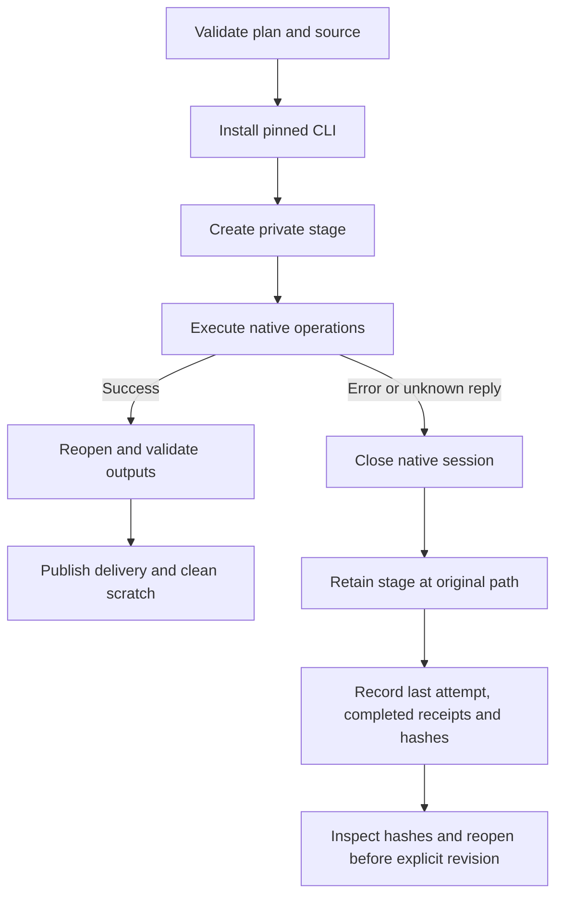

# VectorCraft Failed Stage Architecture

> Candidate implementation; fixed source/plugin installed acceptance remains open. Updated: 2026-10-07.

## Contract and ownership

OpenSpec `VC-TX-004` owns this behavior. The canonical standalone skill provides `scripts/preserved_stage.py`; all domain skills carry their own identical copy. Public workflows retain original failed stages and relative recovery pointers. Failure data is not a delivery manifest and is not accepted by `--source` as a successful project package. Prior immutable releases keep their original behavior.

## Failure records and reconciliation

The owned output contains `failure.json`; its `stage` points to the retained sibling directory, which also contains the failure record, native files, copied dependencies and `recovery-operations.json`. The record binds `status`, `outcome`, original `error`, `lastAttempt`, `completedOperations`, file SHA-256/bytes and `replayAllowed: false`. A submitted operation with an unknown response may already have executed. Never rerun the original plan or delete the retained stage.

Retaining its original absolute path preserves native dependency references. Do not move only the project file or treat proxy capture as recovery. Read the failure record, verify files, reopen the original project using a fresh inspection session, and explicitly reconcile before making a new revision. Portable collection of a recovered project requires separate native validation.

## Concurrency and compatibility

An owned output is bound to device/inode identity. A competing directory or symlink receives no failure record. The private stage still retains diagnostics. Failure-record write errors do not mask the original exception or remove the native stage. Successful stage-to-output renames and Film/Effect native collection retain existing delivery contracts and clean unused scratch. Plan/source preflight or installation failures before staging do not create a recovery directory. Known failures during staged editing also retain partial evidence.

## Evidence and limitations

Native tests use six real post-save response faults per domain and reopen the product-retained original native project, verify inventory hashes and reject replay into the existing output. Lifecycle tests cover success cleanup/rename, directory replacement, symlinks, owned partial outputs and diagnostic write failure. Healthy native creative/revision tests remain required. Fixed releases, actual installed copies and Art bundled-source upgrades have separate gates. Filesystem crash durability, force-killed processes, complete command/GUI/model acceptance and full V1 are not proved by this candidate.
