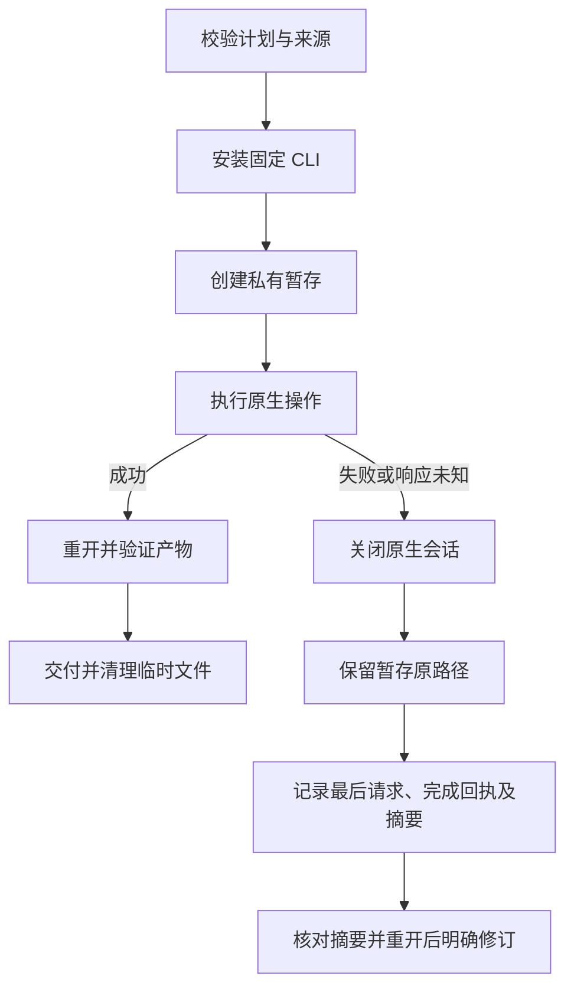

# VectorCraft 失败暂存架构

> 候选实现；固定技能源／插件安装副本验收仍开放。更新：2026-10-07。

## 合同与归属

规范事实源为 OpenSpec `VC-TX-004`。独立技能提供 `scripts/preserved_stage.py`，所有领域技能各自携带同一份实现。公开工作流保留失败暂存原路径及相对恢复指针。失败记录不是交付 manifest，不能作为成功项目包传给 `--source`。已有不可变发行保留原行为。

## 失败记录与核对

本次拥有的输出目录内有 `failure.json`，其中 `stage` 指向保留的同级暂存目录。暂存内同时保留失败记录、原生工程、已复制依赖与 `recovery-operations.json`。记录绑定 `status`、`outcome`、原始 `error`、`lastAttempt`、`completedOperations`、文件 SHA-256／字节数及 `replayAllowed: false`。请求提交后响应未知并不能证明原生操作未执行，禁止直接重跑原计划或删除暂存。

保留原绝对路径可保全原生依赖引用。不能单独移动工程，也不能把代理捕获副本当作恢复工程。先读取记录与核对文件摘要，再以新会话检查原工程，核对实际操作结果后明确建立新修订。恢复工程的便携收集需要另外的原生验证。

## 竞争与兼容性

输出归属绑定设备号／inode；竞争创建、替换目录或符号链接不接收失败记录，诊断仍留在私有暂存。诊断写入失败不遮蔽原异常、不删除工程。正常暂存重命名和 Film／Effect 原生收集沿用既有交付合同，成功后清理未用暂存。进入暂存之前的计划／来源／安装失败不创建恢复目录；已开始暂存编辑的已知失败也保留部分证据。

## 证据与边界

每领域六类真实保存后响应故障测试直接重开产品保留的原暂存工程、核对文件摘要，并验证已有输出拒绝重放。生命周期测试覆盖正常清理／重命名、目录替换、符号链接、已有部分输出与诊断写入失败；健康原生创作／返工回归仍必须通过。固定发行、实际安装副本和 Art 内置领域升级有独立门禁。候选不证明文件系统崩溃持久性、强制杀进程、全量命令／GUI／模型验收或完整 V1。
