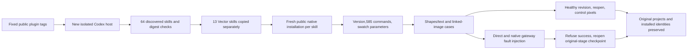

# VectorCraft Fixed Brand Guard First-Use Acceptance Architecture

## Identity and scope

Plugin dev.36 (87d3bd08a61001779d2ca2029ee9c0b309091c2a) pins independent source dev.32 (1bc3078424be4da3273684fd247329046d565180). Native runtime0.2.0-craft.2 is unchanged. This closes only task4.28; full VC-DM-006 and Art bundled upgrades remain open.

## First-use flow

## Method

Install five fixed public-tag plugins into a new isolated host. The actual app-server discovers64 skills with zero loading errors. Copy each of13 Vector skills alone into `.agents/skills/<original-name>`. Its runtime directory is absent before the first public CLI call. Use system PATH without offline archives/download overrides. Check the exact native version,585 live commands and swatch.edit parameter description, then execute two native cases.

Cases contain shapes, editable text, explicit swatch consumers and same-RGB unbound controls; the second also uses a linked PNG. A QA-only copied-session proxy completes the real swatch edit and executes one extra native paint.setFill to simulate an erroneous dependency. Direct and native-command gateway workflows refuse a success manifest, report the target ID and do not replay. Independently reopen retained checkpoints, verify pre-edit brand objects, unchanged artboards and readable/unmodified links. Healthy revisions retain control pixels. Published/installed skills never contain the proxy.

Successful deliveries retain final native projects and dependency reports; temporary checkpoints are released with checkpointRetained:false. Failure checkpoints stay at original paths. After each completed case, inventory/cache-hash verification and a fresh lsof check precede removal of only its downloadable runtime cache. Projects, exports, failure records and skill copies remain.

## Evidence and results

`evidence/craft-vector36-guard-fixed-first-use-20261008.json` binds tags, commits, host discovery, skill hashes, public ZIPs, native reports and CI.13 independent cold installs,26 native tests and52 erroneous-update checks pass in156.809 seconds. All64 installed identities remain unchanged after use.

The other51 skills reuse historical cold evidence only after full-tree identity checks and revalidation of original logs. Effect historical paths omitted the artifacts prefix and stored nested calls.json rather than separate logs; original calls were located and independently checked for reused:false, exact version and640 commands. This is not a claim that51 skills were freshly installed again.

Source regression:143 total,114 passed,29 conditional skips. Plugin:23 passed. Four main/tag CI runs pass on the fixed plugin commit. Public source/plugin ZIP digests exactly match local tag archives. Source has no configured CI; plugin CI does not substitute for source validation.

## Remaining gates

Full VC-DM-006, asset replacement, all commands, GUI, generic Skills CLI installation and V1 remain open. Art plugin115/source87 still bundles Vector source31. Independent Vector36 qualification does not establish that Art has this guard. Old tags and old installed snapshots remain unchanged.

Final maintenance regression initially hit disk-full errors in two temporary repository copies. The original log is retained; no product changes were made. After space recovered, all23 tests passed in3.151 seconds.
