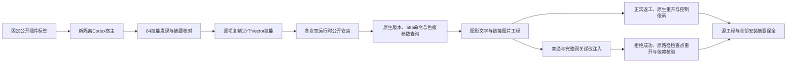

# VectorCraft 固定品牌守卫首用验收架构

## 固定身份与范围

插件dev.36（87d3bd08a61001779d2ca2029ee9c0b309091c2a）固定独立技能源dev.32（1bc3078424be4da3273684fd247329046d565180）。现有原生运行时0.2.0-craft.2未修改。仅关闭VC-DM-006的固定安装子任务4.28，完整需求与Art内置领域包升级继续开放。

## 首次使用链路

## 验收方法

新隔离宿主从五个固定公开标签安装插件，真实app-server发现64技能，加载错误为0。13项Vector技能逐项单独复制到项目 `.agents/skills/<原技能名>`，第一次CLI调用前运行时目录不存在；系统PATH，不使用离线包或下载覆盖参数。每项验证版本、实时585命令及swatch.edit参数，然后执行两项原生场景。

每项场景覆盖图形、文字和具名色板，以及同RGB非消费者。第二项还包含实际链接PNG。QA副本的协议代理仅用于受控注入：真实色板操作后额外执行一次真实paint.setFill，模拟错误消费边。普通工作流与native.command网关均拒绝成功manifest，报告目标ID，不重放；保留检查点独立原生重开，品牌对象恢复为操作前状态、画板不变、链接无缺失／修改。正常返工通过且同RGB控制像素不变。代理没有写入发行或原安装。

成功交付只保留最终原生工程和依赖报告。临时检查点已释放，报告中checkpointRetained为false；失败检查点保留在原暂存路径，不能为打包而移动。每个冷安装结束后，先核验全部缓存文件摘要，再执行fresh lsof确认无占用，只清理本项可重新下载的运行时缓存，保留工程、导出、失败记录和技能副本。

## 证据与结果

`evidence/craft-vector36-guard-fixed-first-use-20261008.json`绑定标签、提交、宿主、每项技能摘要、公开ZIP摘要、原生报告和CI。13次独立冷安装、26项原生测试、52个误改案例通过，耗时156.809秒。64项安装身份保持不变。

其余51技能没有变更：全树摘要一致后复用历史冷启动证据，并重新检查原始version/discovery日志；Effect历史记录路径省略artifacts前缀且使用嵌套calls.json，已定位正确原始目录，直接核验安装reused:false、版本和640命令结果，记录新的原始文件摘要，没有伪称本轮重新安装51项。

源码回归143总／114通过／29条件跳过；插件23通过。插件固定发布提交的main/tag触发四项CI均成功。两份公开ZIP与本地标签归档逐字节一致。技能源仓没有CI配置，不以插件CI替代其源码验证。

## 剩余门禁

本轮不关闭完整VC-DM-006、素材替换、所有命令、GUI、通用Skills CLI安装、完整V1。Art插件115／技能源87仍捆绑Vector技能源31，独立Vector插件36通过不证明Art内置守卫已升级。旧固定标签与已安装旧副本未修改。

最终维护回归曾因磁盘不足在两项临时仓库复制测试报错；原日志保留，没有为通过重跑修改产品。空间恢复后23项全部通过，耗时3.151秒。
