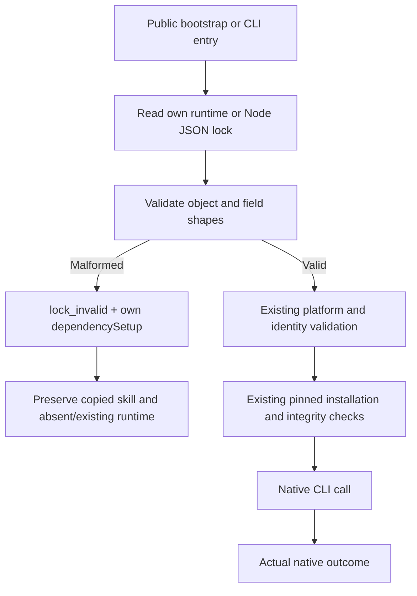

# Candidate structural runtime-lock diagnostics

A valid JSON document can still be an invalid runtime lock. Before this fix, null/list roots, missing keys or wrong field types could escape as internal exceptions. A wrong binary-digest type could also reach directory creation/download before rejection. Public first-use entries then lacked the promised local recovery diagnostic.

## Candidate behavior

Four domain installers validate the runtime root object, artifact mapping, artifact/version types and selected-platform artifact object before filesystem changes. Selected artifacts require string URL, lowercase SHA-256 archive/binary digests and correctly typed optional version/provenance fields. A missing platform remains `unsupported_platform`; a present but malformed platform entry is `runtime_lock_invalid`. Existing release URL, archive extraction, digest, native version, receipt, bounded-download and preservation checks remain in force.

ArtCraft validates the Node lock root, schema and field types before platform/version checks or directory creation. Structural rejection is `node_lock_invalid`. The scope is runtime/Node locks; Art distribution-lock malformed-object preflight needs separate review.

Errors use the existing JSON failure channel with the current skill's own absolute bootstrap path, requested runtime home and `automaticRetry=false`. They do not execute native commands, select siblings or overwrite a damaged installation. Successful installation followed by a native failure retains the existing native-error semantics.

## Evidence boundary

Tests first reproduced the missing behavior in all five source packages. Public subprocess tests then cover malformed roots/fields through bootstrap and CLI; 64 individual source-skill copies separately execute both entries against absent and pre-existing runtimes, totaling256 calls for null locks. Every copied skill and existing sentinel file remains unchanged. Normal-lock candidate native tests separately cover the four domain save/reopen/export/source revisions and Art mixed creation/revision/reuse/moved delivery.

Evidence: `docs/evidence/craft-candidate-lock-shape-diagnostics-20261007.json`. It binds script, skill and test hashes, RED observations and current candidate results. Source mirrors are synchronized across64 skills. The already published plugins still contain their earlier immutable snapshots: this source candidate is not fixed-release installed acceptance.

The existing OpenSpec `*-SK-003-SETUP-FAIL` scenario records the structural rejection boundary. No broad task is closed. Remaining work includes immutable source/plugin publication, fixed installed revalidation, generic Skills CLI actual installation, complete command/scenario and creative acceptance. Other platforms and production remain unverified.
