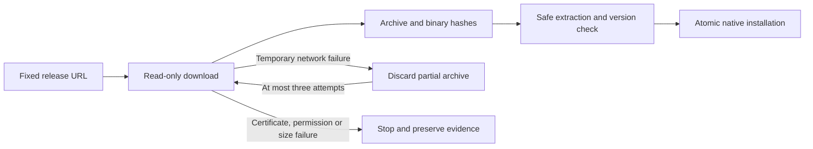

# VectorCraft native download recovery

First use previously stopped on a temporary SSL EOF while downloading the fixed native CLI. The canonical skill installer now makes at most three read-only attempts. It discards partial archives before the next attempt. Native editing is never replayed by this mechanism.

Retries cover SSL EOF, timeout, connection failures, incomplete reads, HTTP 408/429 and HTTP 5xx. Certificate verification, HTTP rejection, permission errors, size limits and checksum failures remain final. Fixed release origins, archive and executable hashes, licensing, safe extraction, native version checks and installation locks remain enforced.

All standalone skills receive the same canonical bootstrap through suite synchronization. Plugins vendor a tagged source snapshot. ArtCraft must pin a new domain bundle before it receives this behavior; its package downloader alone cannot recover a native bootstrap subprocess.

Candidate regression passed. Earlier plugin19/18 and Art80 native editing checks passed, but the independent cold installation gate failed on SSL EOF. Those failures remain evidence. A candidate change and mocked network tests do not close fixed release or full command acceptance. OpenSpec runtime-distribution owns this increment.
