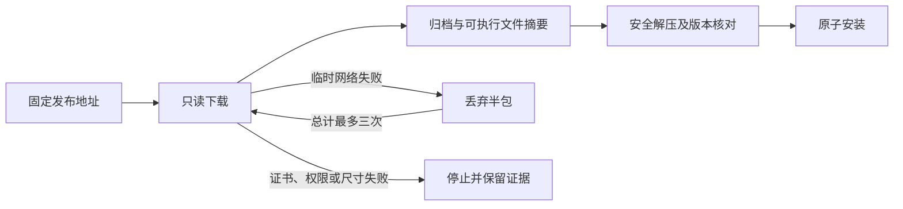

# VectorCraft 原生下载恢复

此前首次使用在下载固定原生 CLI 时遇到临时 SSL EOF 会直接失败。独立技能安装器现在最多执行三次只读下载，重试前丢弃半包。此机制不重放原生编辑操作。

恢复范围为 SSL EOF、超时、连接失败、不完整响应、HTTP 408/429 及 5xx。证书验证、HTTP 拒绝、权限、尺寸限制和摘要失败不因此放宽。固定来源、归档及可执行文件摘要、许可证、安全解压、原生版本检查和安装锁继续生效。

全部独立技能通过同步获得同一安装器；插件从不可变技能源标签收录。ArtCraft 必须固定新的领域包才能获得此行为；仅 Art 包下载器的重试无法恢复领域安装子进程。

候选回归通过。此前插件19/18及Art80的原生编辑验证通过，但独立冷安装门禁因SSL EOF失败，保留失败证据。候选代码及模拟网络测试不能关闭固定发布验收或全部命令验收。本增量由现有 OpenSpec runtime-distribution 管理。
