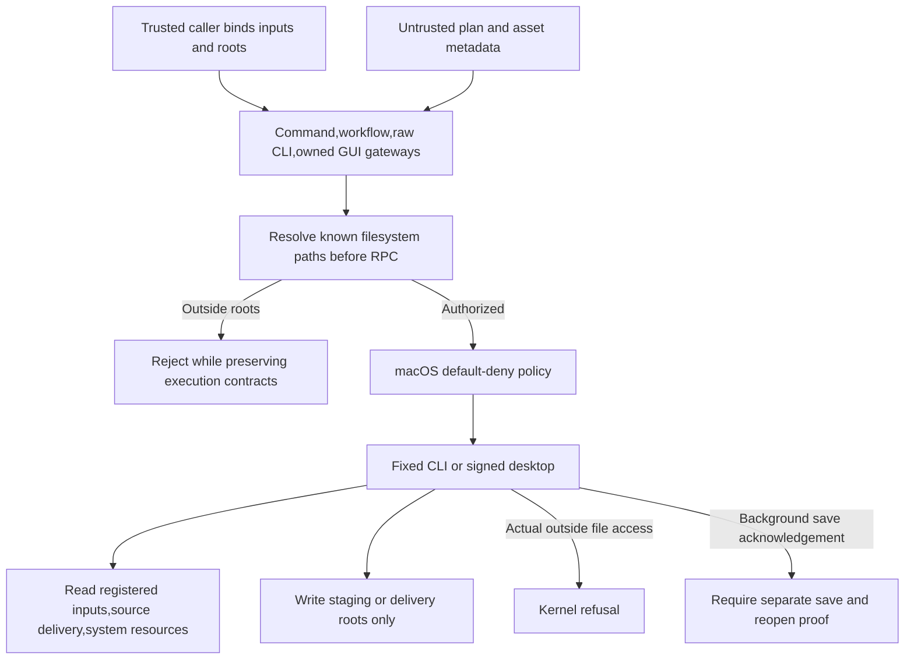

# Native filesystem permission adapter

Source45 is a partial implementation candidate for existing OpenSpec requirement VC-RL-002. Tasks7.4–7.6 remain open. Fixed plugin64 has not yet consumed this source or passed its own fixed-install release gate.

Actual baseline probes exposed outside-file access in the complete command gateway,workflow and GUI. The first sandbox prototype prevented CLI startup. The corrected policy permits reading the root directory itself and metadata for explicit-resource ancestors,including system aliases such as `/var`; it does not grant a user-directory subtree. Symlink targets are checked,with separate native tests that bypass the Python precheck to exercise kernel enforcement.

The complete gateway reads copied registered inputs and writes a new output root. Workflows read a trusted source delivery and write their staging root,including package subdirectories,independent reopen and Boolean checkpoint sessions. Raw CLI calls provide repeatable trusted `--read-root` and `--write-root` options; their default grants no user-project access. GUI and bridge CLI share output roots. Fixed Metal device classes and owned loopback ports come from trusted startup configuration. Unqualified platforms do not silently fall back to unrestricted native execution.

GUI `file.save` can acknowledge a background job before persistence. Outside paths are now refused before submission; positive GUI tests separately save,reopen and export a native project. Direct low-level Session callers must provide their own trusted filesystem policy. This adapter does not sandbox the Python host process.

Evidence is bound to execution-time source. Source44 reports and the failed prototype remain unchanged. Target tests cover authorized input,creation,conversion,GUI persistence and reopen;outside reads,writes and symlinks;aliases,policy fields,control characters,platform refusal,loopback policy and non-filesystem geometry path parameters. Cold installs,full regressions,native revision and fixed-plugin distribution remain separate evidence layers. Command discovery does not establish exhaustive585-command execution.

Pending: complete authorization audit of Python asset preflight,real host secret references,fixed-plugin64 permission qualification,actual host default/explicit routing,all-command applicable contexts and creative conclusions. This implementation is not full VC-RL-002,V1 or marketplace qualification.
