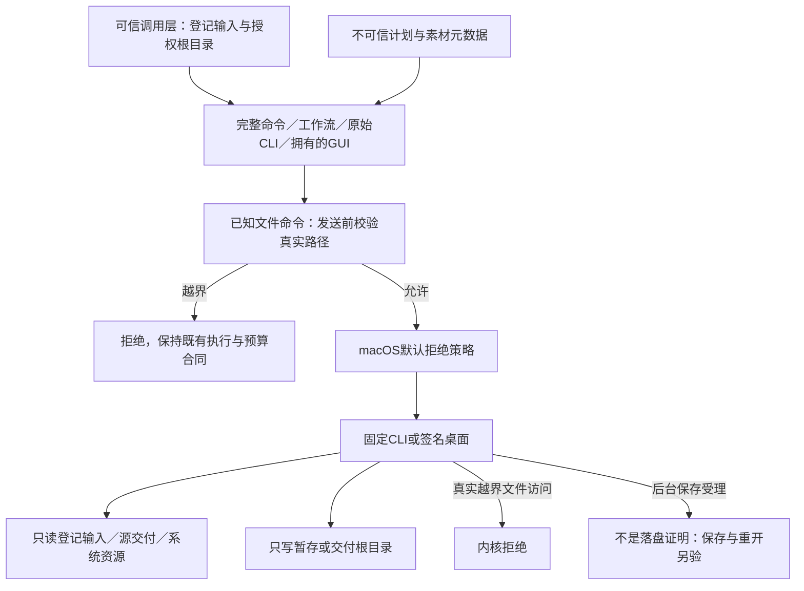

# 原生文件权限适配

本次以 VC-RL-002 为目标，延续现有 OpenSpec 增量规范。技能源45仍是部分实现候选，不关闭7.4–7.6；固定插件64尚未接收该源码，也未通过对应固定安装发布门禁。

真实基线暴露了完整命令、主工作流及GUI的外部文件读写缺口。初版沙箱使原生CLI启动失败；修复为允许根目录本身的读取、显式资源祖先元数据，以及 `/var` 等系统别名的元数据，没有开放整棵用户目录。输出目录内链接按真实目标检查，另有绕过Python预检的原生测试核验内核拒绝。

完整命令读取复制后的登记输入，写入新输出目录；主工作流读取可信来源目录，写入暂存目录，包括打包后的子目录、独立重开及布尔检查点会话。原始CLI提供重复的 `--read-root`／`--write-root`，默认无用户工程权限。GUI应用和桥接CLI共享输出根目录；Metal设备类及回环端口来自可信启动配置，不从模型计划接受。只有固定macOS arm64原生适配，其他平台不回退无约束执行。

GUI的 `file.save` 会先返回 `background: true`，不能把受理当作文件保存成功。本次越界路径在发送前拒绝，正常GUI使用原生保存、重开与导出证明交付。直接低层Session的调用者必须显式传入可信filesystem策略；它不是Python宿主全进程沙箱。

证据按执行时源码绑定，旧源44报告及失败原型保留。权限目标测试覆盖正常输入／创建／转换／GUI保存重开，真实越界读取、写入及链接，系统别名、策略字段、控制字符、平台拒绝、端口策略和几何path参数。冷安装、完整回归、原生修订及固定插件分发各有独立证据，不以命令目录发现替代585条实际命令验收。

尚待完成：Python素材预检入口的完整授权审计、实际宿主秘密引用、固定插件64权限验收、真实宿主默认路由及显式场景、全命令适用上下文和创作结论。不得将本实现提升为完整VC-RL-002、V1或市场资格。

## 源46 Python素材授权候选

Python预检与登记输入复制在读取内容前要求可信授权。受管CLI在素材摘要前检查控制状态、冻结计划及readRoots；独立调用者显式绑定根目录或单个文件。文件描述符逐级打开拒绝链接替换和非普通文件，后续读取复查设备／inode及摘要；私有根目录和身份不进入公共交付记录。源46本地回归独立记录，新素材原生放置、继承返工、冷安装、秘密引用和固定插件验收仍待完成。源45原生／冷启动报告保持原始身份。
