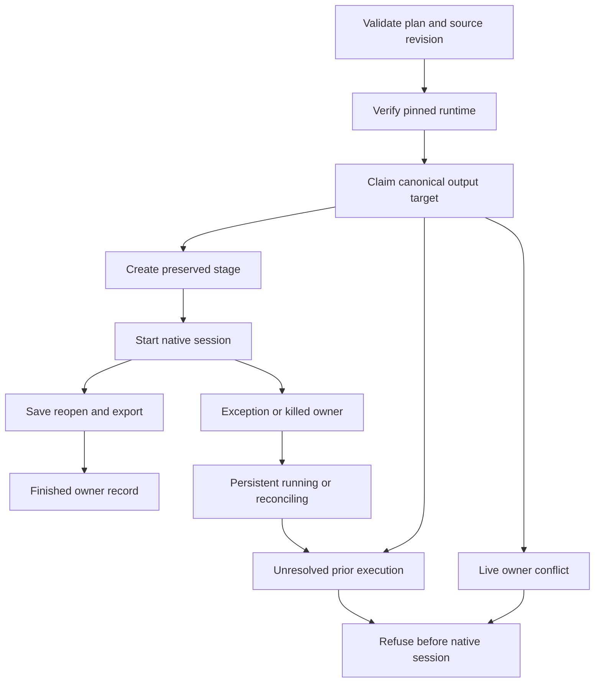

# VectorCraft Output Execution Architecture

## Scope and status

The source candidate adds a canonical output owner to the public `workflow.py` before native sessions. It is synchronized into all 13 independent skills. Source version dev.29 and plugin dev.31 are separate publication gates. Art99 still pins the previous domain skill bundle; Art integration needs its own upgrade and acceptance. Complete task authorization, global idempotency, cancellation and shared budgets remain open.

## Components and control flow

`output_guard.py` uses a no-follow exclusive registration file and a nonblocking process file lock. The target parent contains `.vectorcraft-execution-<canonical-target-sha256>.json`. The same canonical path drives the guard and actual output write. Records bind plan SHA, input SHAs, source project SHA and native executable SHA; original paths and plan bodies are not stored in the record. Existing output directories, invalid records and registration symlinks are preserved and rejected.

## Failure and recovery boundaries

The guard spans stage creation, native operations, reopen and export validation. Normal return records `finished`; exceptions record `reconciling`, and abrupt termination leaves `running`. OS lock release does not prove native children have stopped. Neither state permits automatic replay or record deletion. Users must reconcile the original process and preserved project; choosing a new path does not authorize bypassing that check.

Runtime installation precedes the claim, allowing download repair without creating an execution record. Different targets remain independent. Vector's native command catalog query is read-only and precedes the claim; project sessions remain behind it. Raw CLI commands have their existing contracts: this change protects public workflow execution, without claiming all CLI writes have a global lease.

## First-use resources and verification

Each installed skill contains its own helper, workflow and `references/output-execution.md`, with no sibling or Film skill dependency. Native binaries and runtime locks remain unchanged. Tests reproduce session startup without a claim, then cover seven ownership and preservation cases, including an owned real subprocess killed with SIGKILL. Cold native creation and revision verify editable project hashes, reopen/export, original output preservation and completed records bound to effective plans and source revisions.

Candidate evidence and fixed installation evidence are recorded separately. Unit tests, native technical fixtures and visual/creative acceptance remain distinct. Only the bounded source and fixed-installation tasks may close; the full TX contracts remain open.
