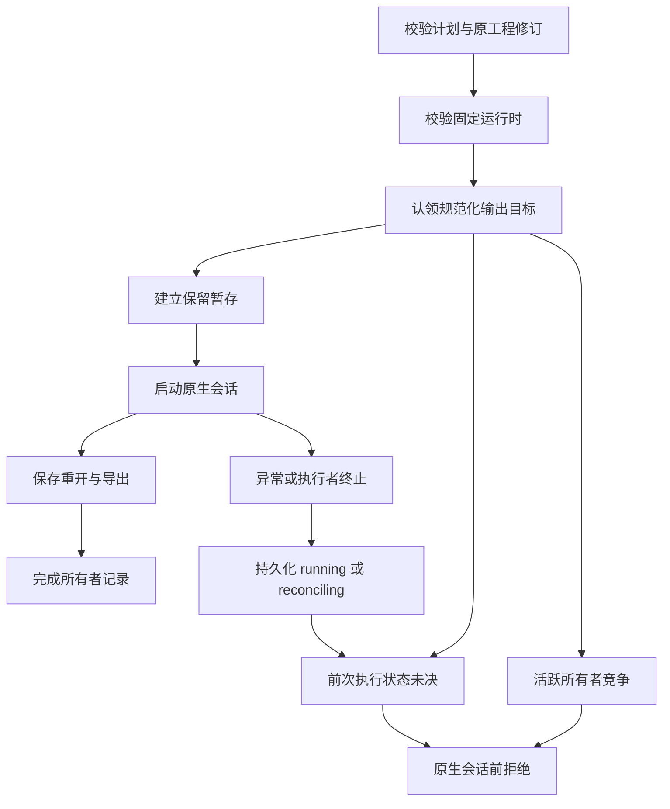

# VectorCraft 输出执行架构

## 范围与状态

源码候选为公开 `workflow.py` 增加原生会话前的规范化输出所有者，同步到 13 个独立技能。技能源 dev.29 和插件 dev.31 的发布与固定安装是分别验收的门禁。Art99 仍固定旧领域技能包，Art 集成需要单独升级并验证。完整任务授权、全局幂等、取消与共享预算仍开放。

## 组件与控制流

`output_guard.py` 使用不跟随符号链接的独占登记文件和非阻塞进程文件锁。目标父目录包含 `.vectorcraft-execution-<规范化目标路径摘要>.json`，保护与实际写入使用同一规范化路径。记录绑定计划、素材、原工程和原生二进制摘要，不保存原始素材路径与计划正文。已有输出目录、未知登记与符号链接均保留并拒绝。

## 失败与恢复边界

保护覆盖暂存创建、原生操作、重开和导出检查。正常返回记录 `finished`，异常记录 `reconciling`，突然终止留下 `running`。系统释放文件锁不证明原生子进程已停止，两种未决状态均不允许自动重放或删除登记。需要核对原进程及保留工程，换目标路径不代表可以绕过核对。

运行时安装发生在认领前，下载修复不产生执行登记，不同目标保持独立。Vector 的原生命令目录查询属于认领前的只读检查，工程会话仍受保护。原始 CLI 命令沿用原合同：本变更保护公开工作流，不宣称所有 CLI 写入已有全局租约。

## 首次使用资源与验证

每个独立技能都包含保护脚本、工作流和 `references/output-execution.md`，不依赖兄弟技能或 Film 技能。原生二进制与运行时锁不变。测试先复现认领前启动会话的缺陷，再覆盖七项竞争与保全行为，包括真实自有子进程 SIGKILL。冷原生创建和返工检查可编辑工程摘要、重开／导出、原交付保全，以及完成记录与实际计划、原工程的绑定。

候选证据与固定安装证据分别记录；单元测试、原生技术样例与视觉／创作验收区分。只关闭有证据的源码及固定安装子任务，不关闭完整 TX 合同。
