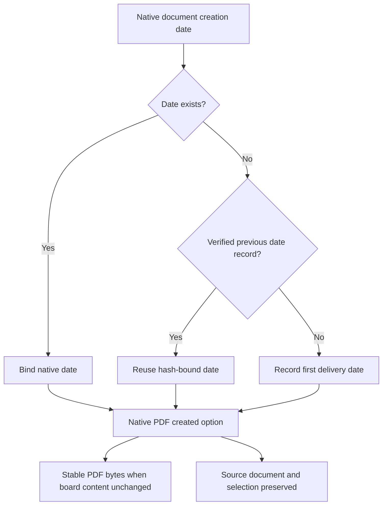

# VectorCraft stable PDF export dates

ArtCraft's real mixed brand revision exposed a remaining first-use gap after SVG isolation: the unrelated SVG/PNG stayed identical, but PDF CreationDate/ModDate changed with the export clock. The old single-domain identity gate did not span different seconds. [Actual failure](evidence/mixed-pdf-date-failure-20261006.json).

The candidate CLI 0.2.0-craft.2 exposes the PDF encoder's existing `created` option as integer Unix seconds or null; invalid types fail and omitted/null retain legacy current-time defaults. The workflow records `pdf-export-date.json`, binds its digest into the delivery manifest and includes date/binding in PDF output records. A future revision verifies the prior date record and rejects tampering or a native-date binding mismatch. Native project creation dates and actual revision history remain in the editable project.

956 engine library tests pass, including explicit 2000-01-01 PDF date, identical repeated PDF bytes and invalid-type/source-preservation cases. The source suite passes 33 tests with 16 deliberate skips. The candidate single export skill installs an explicitly supplied local archive; revisions separated by 2.1 seconds preserve all unrelated SVG/PNG/PDF bytes and independently decoded PDF dates in 3.329 seconds. [Candidate evidence](evidence/pdf-export-date-candidate-20261006.json). This is not public CLI download or fixed new plugin evidence.

Public maintained runtime craft.1 and plugin dev.9 remain immutable. Task 4.23 and ArtCraft task 6.33 stay open until craft.2 distribution, immutable skill/plugin updates and actual mixed first-use acceptance pass. Reproduction uses `tests/test_artboard_exports_first_use.py` and `tests/test_brand_token_mixed_first_use.py`; no normalization of PDF bytes replaces the identity gate.
