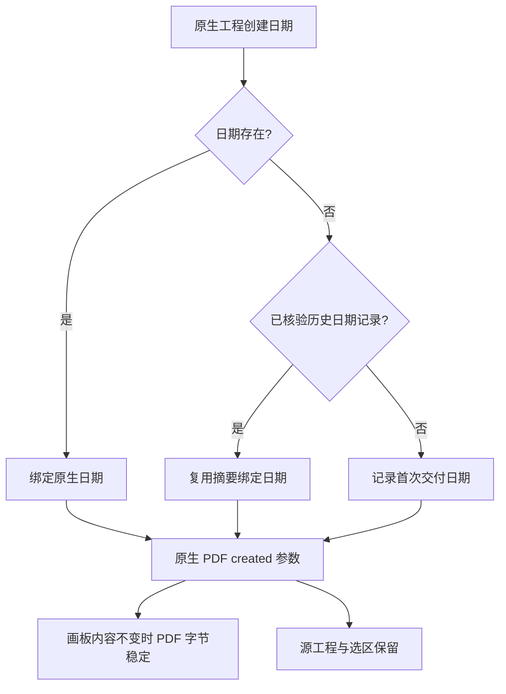

# VectorCraft PDF 导出日期稳定性

ArtCraft 的真实品牌混合返工暴露了 SVG 隔离后的剩余缺口：无关 SVG／PNG 已保持一致，但 PDF 创建／修改日期随导出时刻变化。先前单领域字节门禁没有跨越不同秒。[真实失败](evidence/mixed-pdf-date-failure-20261006.json)。

候选 CLI 0.2.0-craft.2 暴露 PDF 编码器已有的 `created` 参数，只接受整数 Unix 秒或 null；拒绝无效类型，未指定或 null 保持旧调用的当前导出时刻默认行为。工作流保存 `pdf-export-date.json`，把文件摘要绑定到交付清单，并在 PDF 输出记录中登记日期与来源。再次返工核验原日期记录，拒绝摘要篡改或原生日期绑定漂移。原生创建日期和实际修订历史继续保留在可编辑工程中。

956 项引擎库测试通过，覆盖明确的 2000-01-01 PDF 日期、重复字节一致、无效类型与源保全。技能源测试通过 33 项、显式跳过 16 项。单导出技能以显式本地候选 ZIP 安装，修订间隔 2.1 秒后无关 SVG／PNG／PDF 字节与独立解码的 PDF 日期保持一致，耗时 3.329 秒。[候选证据](evidence/pdf-export-date-candidate-20261006.json)。这不代表公开 CLI 下载或固定新插件验收。

公开维护版 craft.1 和插件 dev.9 保持不可变。4.23 与 ArtCraft 6.33 仍开放，直到 craft.2 运行时、不可变技能／插件更新和真实混合首次使用通过。复现驱动是 `tests/test_artboard_exports_first_use.py` 与 `tests/test_brand_token_mixed_first_use.py`，不通过规范化 PDF 字节替代身份门禁。

维护版运行时 craft.2 现已发布；工作区技能安装锁已接入该运行时，单导出技能实际公开 HTTPS 冷安装、跨秒字节与日期解码门禁在 7.228 秒内通过，12 项 CLI 集成测试通过。不可变技能源 dev.9／插件 dev.10 与 ArtCraft 接入仍待完成。[公开原生证据](evidence/pdf-export-date-public-runtime-20261006.json)。
