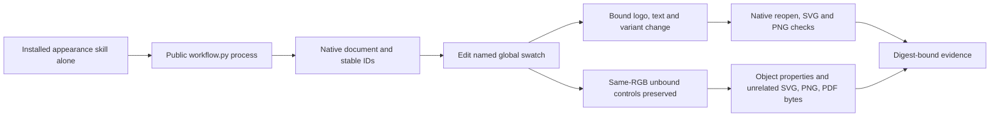

# VectorCraft Same-Color Non-Consumer Acceptance Architecture

## Scope and authority

This adds selective RGB-token update evidence for VC-DM-006. The domain plugin OpenSpec file `openspec/changes/establish-v1-plugin/specs/domain-workflow/spec.md` remains authoritative. Fixed plugin dev.35 and source dev.31 are unchanged; no skill/runtime changes or new tags.

## Execution and data flow

## Verification

Copy only the installed `vectorcraft-cli-appearance` skill. Run its public create/revision entry in separate Python processes with system PATH and download overrides removed. Reuse the previously verified runtime; this is not a fresh cold-install claim. Add two controls with direct RGB `#2366e8`, one on a brand board and one on the independent icon board, without a swatch link.

Change the named brand swatch to `#175cce`. Three bound consumers change. Every other native object retains its stable ID and own properties. Compare container properties separately from descendants to avoid falsely rejecting legitimate child changes. Both same-color controls retain their original PNG pixels; unrelated SVG/PNG/PDF bytes remain identical. All original delivery files and copied skill files retain their digests.

## Evidence and failures

`evidence/vectorcraft-same-color-token-20261008.json` binds the driver, fixed identities, input/output digests and consumer/control IDs. One native case passed in 0.297 seconds. The first attempt used a PATH Python without Pillow. The second compared a whole parent layer containing changed children. Both logs are retained as environment/oracle errors. Existing Anaconda Python and per-object comparisons resolved them; this is not a product red/green claim.

## Limits

The complete VC-DM-006 contract still needs asset-dependency replacement and erroneous-dependency reporting checks. No requirements or tasks close here. Other color models, GUI, every command, generic Skills CLI installation and complete V1 remain separate. Global 64-skill identity verification is separate from this one-skill native execution.
