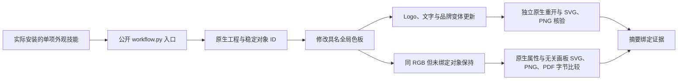

# VectorCraft 同色非消费者验收架构

## 范围与事实源

本轮补齐 VC-DM-006 的品牌 token 选择性更新证据。行为事实源仍是 `openspec/changes/establish-v1-plugin/specs/domain-workflow/spec.md`（领域插件仓库）。固定版本为插件 dev.35／技能源 dev.31；没有修改技能或运行时，没有发布新标签。

## 数据与执行链

## 验收方法

只复制已安装 `vectorcraft-cli-appearance`，使用系统 PATH，排除运行时下载覆盖参数，通过独立 Python 子进程执行公开创建与返工入口。复用此前已校验的运行时，因此不声称本轮冷安装。两项新增控制对象直接设置 RGB `#2366e8`，分别位于品牌画板和独立图标画板；它们没有绑定全局品牌色板。

返工将品牌色板改为 `#175cce`。Logo、文字和品牌变体三个绑定消费者发生变化。每个其他原生对象 ID 及其自身属性保持一致；容器的子对象按独立 ID 比较，避免合法子对象修改造成假失败。两个同色控制对象的 PNG 像素仍为原 RGB；独立图标画板三种导出字节保持不变。原交付全文件摘要与技能全文件摘要保持一致。

## 证据与失败分类

证据为 `evidence/vectorcraft-same-color-token-20261008.json`，包含驱动、固定身份、输入和输出摘要、三个消费者及三个控制对象 ID。实际原生用例 1 项通过，0.297 秒。初次使用 PATH Python 缺少 Pillow；随后测试错误地比较了包含子对象的整个父层。两次日志保留，分别归类环境错误和测试断言错误；既有 Anaconda 环境及逐对象断言修正后通过。这不是产品缺陷红绿证明。

## 限制与后续

完整 VC-DM-006 还需结合素材依赖替换及异常依赖边报告核验；本轮不关闭该需求或任何任务，不替代其他颜色模型、GUI、全部命令、通用 Skills CLI 安装与完整 V1。64 技能身份核验另有全局审计；本轮原生执行只有上述单技能用例。
