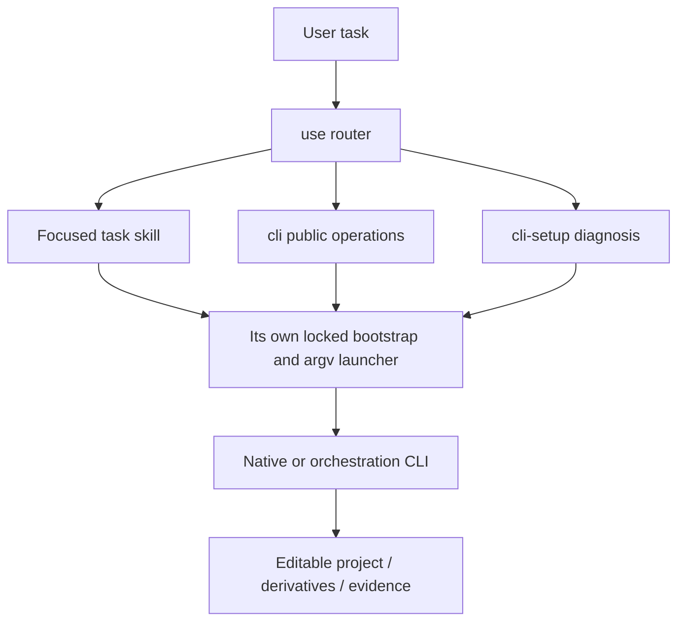

# VectorCraft Skill Suite Architecture

> Updated: 2026-10-05. Skill/plugin development version: 0.1.0-dev.3; native/orchestration runtime: 0.2.0. Target behavior is owned by the existing OpenSpec change.

## 1. Why a suite

The original single use skill gave a working bootstrap and representative native workflow, but had broad discovery and insufficient task routing. The revised suite follows Dreamina's entrypoint / CLI / setup / task pattern, with command groups derived from the inspected source and actual installed runtime. It does not create fake auth or generation interfaces. This package contains 12 skills.

## 2. Responsibilities and routing

| Skill | Task boundary |
| :--- | :--- |
| `vectorcraft-use` | use |
| `vectorcraft-cli` | cli |
| `vectorcraft-cli-setup` | cli setup |
| `vectorcraft-cli-project` | cli project |
| `vectorcraft-cli-paths` | cli paths |
| `vectorcraft-cli-shapes` | cli shapes |
| `vectorcraft-cli-boolean` | cli boolean |
| `vectorcraft-cli-text` | cli text |
| `vectorcraft-cli-appearance` | cli appearance |
| `vectorcraft-cli-artboards` | cli artboards |
| `vectorcraft-cli-assets` | cli assets |
| `vectorcraft-cli-export` | cli export |



## 3. Single-skill packaging and CLI lifecycle

Each skill contains its own necessary scripts, runtime locks, workflow reference and examples. There are no sibling-directory reads or symlinks. `scripts/sync_skill_suite.py` copies canonical executable resources from the use skill during source maintenance; `--check` rejects drift. Scenario descriptions and command evidence remain individually maintained. This duplicates distribution resources to support granular installations while avoiding multiple hand-edited implementations.

The launcher accepts native argv after `--`, validates the leading subcommand before installation, invokes a fixed checksummed executable without a shell, preserves exit status and bounds waiting. Unknown operation/platform/corrupt install fails. Native parameters, command IDs and enabled state are discovered at runtime. Output timeouts are unknown results, not proof that writes never happened. Save a native checkpoint and inspect before any replay.

## 4. Source evidence and differences

Research checkout: `storytold/vectorcraft` at `36a6a8ae49f0e2d1059361ab1f842b1ec172bc9e`. CodeGraph indexed 797 files, 20450 nodes and 102834 edges. CLI parser and engine dispatch were investigated separately from installed command catalogues; current source and release binary may differ. See [research evidence](evidence/upstream-codegraph.json).

FilmCraft uses tick-based timeline commands and save/save-as; EffectCraft has comp/layer property paths and render channels; PhotoCraft has ordered run flags and persistent serve; VectorCraft uses ordered run/export steps and distinct artboard/range indices. Upstream ArtCraft is a Tauri scene/generation application with scene asset persistence and asynchronous provider task notifications. Our ArtCraft CLI is the existing local DAG/ledger runtime, implemented independently; no upstream ArtCraft code or branding assets are copied.

## 5. Validation and release

`tests/test_skill_suite.py` isolates every skill, verifies CLI discovery and catalogue subsets against the pinned runtime, and refuses unsupported subcommands before creating a runtime directory. Existing native workflow suites verify editable delivery and revisions. Individual discovery success does not prove all task commands, creative quality, GUI or cross-editor fidelity. Shared resources are checked and each SKILL.md validated; native/platform and host results are reported separately.

Run from the independent skill repository:

```bash
python3 -B scripts/sync_skill_suite.py --check
python3 -B -m unittest discover -s tests -p test_skill_suite.py -v
CRAFT_LIVE_SUITE=1 python3 -B -m unittest discover -s tests -p test_skill_suite.py -v
```

Install one skill with `npx skills add full-aigc-skills/vectorcraft-skills --skill <skill-name>`; invoke its actual absolute directory, not a sibling path. Plugin packaging must bind the complete suite to a fixed source tag, commit and per-skill digest. Former tags remain immutable, and existing use/workflow payloads stay compatible.
